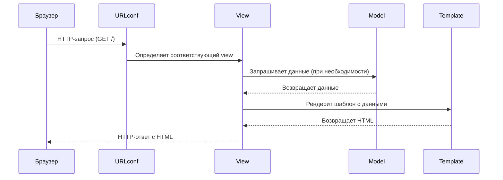

# Тема Django. MTV. Первые маршруты. Создание Django App 🏗️

## Концепция приложений в Django 📦

В Django приложения - это модульные компоненты, которые инкапсулируют определенную функциональность проекта. Это ключевая архитектурная концепция, позволяющая создавать масштабируемые и поддерживаемые веб-приложения. Каждое приложение должно решать одну конкретную задачу, например: аутентификацию пользователей, работу с блогом или обработку заказов.

Приложения в Django следуют принципу "одна ответственность" - они должны быть максимально независимыми и самодостаточными. Это позволяет легко переиспользовать код между проектами и упрощает командную разработку. Например, в нашем проекте `core` отвечает за основную бизнес-логику барбершопа - запись клиентов, управление мастерами и расписанием.

>[!info]
>
>#### Основные принципы приложений
>
>- **Изолированность**: Приложение должно содержать все необходимое для своей работы - модели, представления, шаблоны, статические файлы
>- **Повторное использование**: Хорошее приложение можно перенести в другой проект с минимальными изменениями
>- **Специализация**: Каждое приложение решает одну конкретную задачу (например, только аутентификацию или только блог)
>- **Низкая связность**: Приложения должны минимально зависеть друг от друга

При разработке Django-приложений важно следовать этим принципам с самого начала проекта. Например, если мы создаем приложение для управления записями в барбершопе, оно должно содержать только логику, связанную с этой задачей - модели клиентов, мастеров и записей, соответствующие представления и шаблоны. Вся логика аутентификации пользователей должна быть вынесена в отдельное приложение, например `users`.

>[!warning]
>
>#### Типичные ошибки
>
>- Создание одного "монолитного" приложения на весь проект
>- Слишком сильная связность между приложениями
>- Нарушение принципа единственной ответственности

## Создание и подключение приложения 🔌

Создание нового приложения в Django - это первый шаг после настройки проекта. Для этого используется команда `startapp`, которая генерирует базовую структуру приложения. В нашем случае мы создаем приложение `core`:

```bash
poetry run python manage.py startapp core
```

Эта команда создает папку `core` со стандартной структурой файлов Django-приложения. Важно понимать, что просто создать приложение недостаточно - его нужно явно подключить в настройках проекта.

После создания приложения его необходимо добавить в `INSTALLED_APPS` в файле настроек `settings.py`:

```python
# barbershop/settings.py
INSTALLED_APPS = [
    'django.contrib.admin',
    'django.contrib.auth',
    'django.contrib.contenttypes',
    'django.contrib.sessions',
    'django.contrib.messages',
    'django.contrib.staticfiles',
    'core',  # Добавляем наше приложение после стандартных
]
```

Подключение приложения в `INSTALLED_APPS` делает его частью Django-проекта и позволяет использовать все возможности фреймворка - от миграций базы данных до работы с шаблонами. Важно отметить, что Django автоматически ищет определенные файлы в подключенных приложениях, например `models.py` для регистрации моделей или `admin.py` для настройки административного интерфейса.

>[!warning]
>
>#### Важные моменты подключения
>
>- Имя приложения в `INSTALLED_APPS` должно точно соответствовать имени папки приложения и модуля (в нашем случае `core`)
>- Порядок приложений может влиять на переопределение шаблонов и статических файлов
>- Новые приложения лучше добавлять после стандартных приложений Django

При создании приложения вручную важно точно воспроизвести стандартную структуру Django. Например, файл `apps.py` должен содержать класс конфигурации приложения, который наследуется от `django.apps.AppConfig`. Этот класс позволяет задавать метаданные приложения, такие как его имя и путь, что особенно важно при использовании нестандартных путей к приложению.

>[!info]
>
>#### Альтернативные способы создания приложений
>
>- Можно создать приложение вручную, скопировав структуру
>- Некоторые IDE (PyCharm) имеют встроенные инструменты для создания Django-приложений
>- Существуют шаблоны и cookiecutters для генерации приложений с дополнительной структурой

## Обзор созданного приложения `Core` 🗂️

После выполнения команды `startapp core` создается стандартная структура Django-приложения. Давайте подробно рассмотрим назначение каждого файла и директории:

```
core/
├── __init__.py       # Пустой файл, указывающий что это Python-пакет
├── admin.py          # Регистрация моделей для админ-панели Django
├── apps.py           # Конфигурация приложения (настройки, название)
├── migrations/       # Хранит миграции базы данных (пока пустая)
├── models.py         # Определение моделей данных приложения
├── tests.py          # Модуль для написания unit-тестов
└── views.py          # View-функции (обработчики HTTP-запросов)
```

Каждый файл в структуре приложения имеет четкое назначение. Например, `models.py` определяет структуру данных, которые будут храниться в базе данных. Django автоматически создает соответствующие таблицы на основе этих моделей. Файл `views.py` содержит функции или классы, которые обрабатывают HTTP-запросы и возвращают HTTP-ответы. Эти компоненты работают вместе, следуя паттерну MTV, который мы рассмотрим далее.

>[!info]
>
>#### Назначение ключевых файлов
>
>- `models.py` - сердце приложения, здесь определяются модели данных
>- `views.py` - содержит логику обработки запросов
>- `admin.py` - настройки интерфейса администратора
>- `migrations/` - автоматически генерируемые файлы миграций

Каждый из этих файлов играет важную роль в архитектуре приложения. Например, `models.py` определяет структуру данных, которые будут храниться в базе, а `views.py` содержит функции, которые обрабатывают HTTP-запросы и возвращают ответы.

>[!warning]
>
>#### Особенности структуры
>
>- Не удаляйте и не переименовывайте стандартные файлы
>- `migrations/` должна оставаться пустой до создания моделей
>- `__init__.py` обязателен для работы приложения как Python-пакета

## Знакомство с MTV паттерном 🧩

MTV (Model-Template-View) - это архитектурный паттерн, используемый в Django. На изображении ниже показано взаимодействие компонентов:


**Основные компоненты:**

- **Модель (Model)**: Определяет структуру данных и бизнес-логику
- **Шаблон (Template)**: Отвечает за представление данных (HTML)
- **Представление (View)**: Обрабатывает запросы и возвращает ответы

Отличие от классического MVC в том, что в Django "View" соответствует "Controller" в MVC, а "Template" - "View".

## Первый маршрут 🛣️

Маршрут (path) связывает URL с функцией-обработчиком (view). В нашем примере:
В Django маршруты определяют, какая функция или класс будет обрабатывать запрос по определенному URL. В нашем примере мы создаем простой обработчик для главной страницы. Функция `landing` принимает объект запроса `request` и возвращает HTTP-ответ с простым HTML-заголовком. Это минимальный пример view-функции в Django.

```python
# core/views.py
from django.shortcuts import HttpResponse

def landing(request):
    """Обработчик главной страницы"""
    return HttpResponse("<h1>Главная страница</h1>")
```

После создания view-функции необходимо связать ее с конкретным URL. Это делается в файле `urls.py` основного проекта. Мы импортируем нашу функцию `landing` из приложения `core` и добавляем ее в список `urlpatterns`. Пустая строка в path("", ...) означает корневой URL сайта. Параметр `name` позволяет ссылаться на этот маршрут по имени в других частях проекта.

```python
# barbershop/urls.py
from django.contrib import admin
from django.urls import path
from core.views import landing

urlpatterns = [
    path("admin/", admin.site.urls),  # Админ-панель
    path("", landing, name="home"),  # Главная страница
]
```

Таким образом, мы создали первый работающий маршрут в Django-приложении. При переходе на корневой URL сайта будет вызываться функция `landing`, которая вернет простой HTML-заголовок. Это базовая, но важная концепция, на которой строится вся маршрутизация в Django.



В следующих уроках мы рассмотрим более сложные примеры с параметрами URL и различными типами ответов.

>[!info]
>
>#### Основные понятия
>
>- **View**: Функция, принимающая запрос (`request`) и возвращающая ответ
>- **Path**: Связывает URL с view-функцией
>- **HTTP Response**: Ответ сервера клиенту (в нашем случае HTML)
>
```
