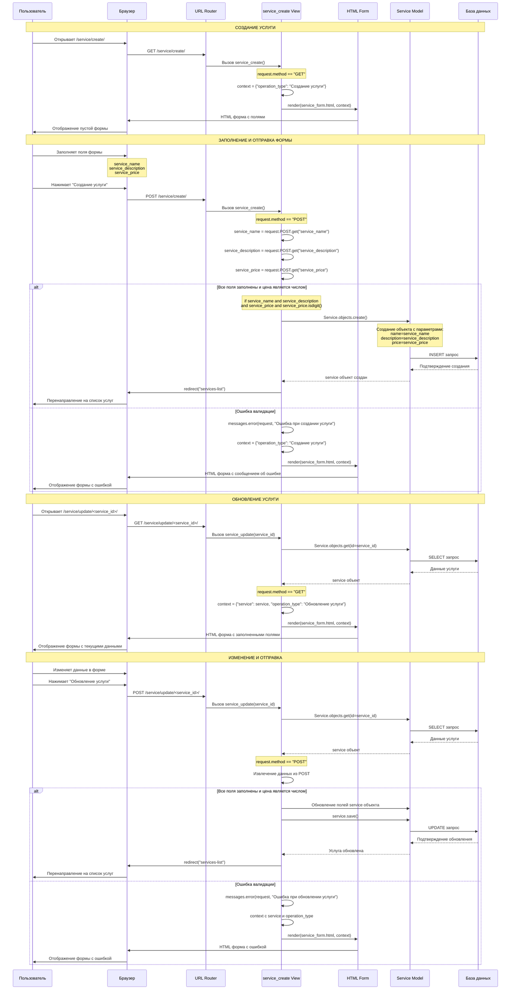

```mermaid
sequenceDiagram
    participant User as Пользователь
    participant Browser as Браузер
    participant URL as URL Router
    participant View as service_create View
    participant Form as HTML Form
    participant Model as Service Model
    participant DB as База данных

    Note over User, DB: СОЗДАНИЕ УСЛУГИ

    User->>Browser: Открывает /service/create/
    Browser->>URL: GET /service/create/
    URL->>View: Вызов service_create()
    
    Note over View: request.method == "GET"
    View->>View: context = {"operation_type": "Создание услуги"}
    View->>Form: render(service_form.html, context)
    Form->>Browser: HTML форма с полями
    Browser->>User: Отображение пустой формы

    Note over User, DB: ЗАПОЛНЕНИЕ И ОТПРАВКА ФОРМЫ

    User->>Browser: Заполняет поля формы
    Note over Browser: service_name<br/>service_description<br/>service_price
    User->>Browser: Нажимает "Создание услуги"
    Browser->>URL: POST /service/create/
    URL->>View: Вызов service_create()

    Note over View: request.method == "POST"
    View->>View: service_name = request.POST.get("service_name")
    View->>View: service_description = request.POST.get("service_description")
    View->>View: service_price = request.POST.get("service_price")

    alt Все поля заполнены и цена является числом
        Note over View: if service_name and service_description<br/>and service_price and service_price.isdigit()
        
        View->>Model: Service.objects.create()
        Note over Model: Создание объекта с параметрами:<br/>name=service_name<br/>description=service_description<br/>price=service_price
        Model->>DB: INSERT запрос
        DB-->>Model: Подтверждение создания
        Model-->>View: service объект создан
        View->>Browser: redirect("services-list")
        Browser->>User: Перенаправление на список услуг

    else Ошибка валидации
        View->>View: messages.error(request, "Ошибка при создании услуги")
        View->>View: context = {"operation_type": "Создание услуги"}
        View->>Form: render(service_form.html, context)
        Form->>Browser: HTML форма с сообщением об ошибке
        Browser->>User: Отображение формы с ошибкой
    end

    Note over User, DB: ОБНОВЛЕНИЕ УСЛУГИ

    User->>Browser: Открывает /service/update/<service_id>/
    Browser->>URL: GET /service/update/<service_id>/
    URL->>View: Вызов service_update(service_id)
    
    View->>Model: Service.objects.get(id=service_id)
    Model->>DB: SELECT запрос
    DB-->>Model: Данные услуги
    Model-->>View: service объект

    Note over View: request.method == "GET"
    View->>View: context = {"service": service, "operation_type": "Обновление услуги"}
    View->>Form: render(service_form.html, context)
    Form->>Browser: HTML форма с заполненными полями
    Browser->>User: Отображение формы с текущими данными

    Note over User, DB: ИЗМЕНЕНИЕ И ОТПРАВКА

    User->>Browser: Изменяет данные в форме
    User->>Browser: Нажимает "Обновление услуги"
    Browser->>URL: POST /service/update/<service_id>/
    URL->>View: Вызов service_update(service_id)

    View->>Model: Service.objects.get(id=service_id)
    Model->>DB: SELECT запрос
    DB-->>Model: Данные услуги
    Model-->>View: service объект

    Note over View: request.method == "POST"
    View->>View: Извлечение данных из POST
    
    alt Все поля заполнены и цена является числом
        View->>Model: Обновление полей service объекта
        View->>Model: service.save()
        Model->>DB: UPDATE запрос
        DB-->>Model: Подтверждение обновления
        Model-->>View: Услуга обновлена
        View->>Browser: redirect("services-list")
        Browser->>User: Перенаправление на список услуг

    else Ошибка валидации
        View->>View: messages.error(request, "Ошибка при обновлении услуги")
        View->>View: context с service и operation_type
        View->>Form: render(service_form.html, context)
        Form->>Browser: HTML форма с ошибкой
        Browser->>User: Отображение формы с ошибкой
    end
```