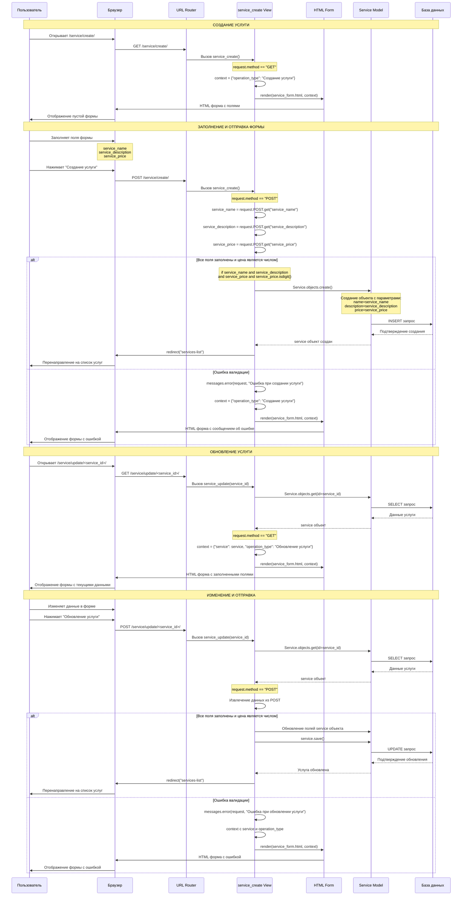

# Тема Django Формы Ч1. Как обрабатывать простые формы? Знакомство с инструментами. Урок 59

В этом уроке мы начинаем большое путешествие в мир обработки пользовательского ввода в Django. Сегодня мы сосредоточимся на самых основах: как безопасно принять данные из простой HTML-формы, написанной вручную, и что для этого нужно. Мы также коснемся одного из важнейших механизмов безопасности в Django — защиты от CSRF-атак.

## 🛡️ Механизмы защиты в Django - CSRF

Безопасность — это фундамент любого веб-приложения. Прежде чем мы начнем обрабатывать данные от пользователей, мы должны убедиться, что делаем это безопасно. Django предоставляет встроенные инструменты для защиты от многих распространенных уязвимостей, и одна из ключевых — это защита от CSRF.

### 🤔 Что такое CSRF?

CSRF (Cross-Site Request Forgery) или "Межсайтовая подделка запроса" — это тип атаки, при которой злоумышленник заставляет браузер аутентифицированного пользователя выполнить нежелательное действие на сайте, которому пользователь доверяет. Представьте, что вы залогинены на своей любимой социальной платформе. Вы переходите по ссылке, которую вам прислал друг, на сайт с забавными картинками. Без вашего ведома этот сайт в фоновом режиме отправляет запрос на вашу социальную платформу, чтобы, например, опубликовать пост от вашего имени или изменить ваш пароль. Поскольку вы все еще залогинены, ваш браузер услужливо прикрепляет к этому вредоносному запросу ваши сессионные cookie, и социальная платформа, не видя подвоха, выполняет действие. В этом и заключается суть атаки: эксплуатация доверия сайта к вашему браузеру.

### ❓ Почему важно быть защищенным от CSRF?

Защита от CSRF критически важна, потому что такие атаки могут привести к серьезным и необратимым последствиям. Если ваше приложение управляет финансами, злоумышленник может инициировать перевод средств. Если это социальная сеть — он может рассылать спам от вашего имени, удалять друзей или менять личные данные. В случае административной панели — он может удалить пользователей или изменить ключевые настройки сайта. По сути, любая операция, которую может выполнить залогиненный пользователь, может быть выполнена и злоумышленником через CSRF-атаку. Именно поэтому Django подходит к этому вопросу очень серьезно и предоставляет надежный механизм защиты "из коробки".

> [!warning]
>
> #### ⚠️ Важность защиты от CSRF
>
> CSRF-атаки позволяют злоумышленникам выполнять действия от имени пользователя без его ведома. Защита критически важна для безопасности веб-приложений, так как предотвращает несанкционированные операции.

### 🔐 Тег шаблонизатора `` и куда его помещать?

Для защиты от CSRF-атак Django использует элегантный и надежный механизм, основанный на секретном токене. Этот процесс можно разбить на несколько шагов:

1. **Генерация токена**: Когда пользователь запрашивает страницу с формой, Django генерирует уникальный, криптографически случайный токен (CSRF-токен).
2. **Отправка токена клиенту**: Этот токен отправляется клиенту двумя путями. Во-первых, он устанавливается в виде cookie (`csrftoken`) в браузере пользователя. Во-вторых, при использовании тега `` в шаблоне, тот же самый токен вставляется в HTML-код формы в виде скрытого поля `<input type="hidden" name="csrfmiddlewaretoken" value="...">`.
3. **Отправка формы**: Когда пользователь отправляет форму (совершает POST-запрос), браузер автоматически прикрепляет cookie `csrftoken` к запросу, а данные из скрытого поля отправляются вместе с остальными данными формы.
4. **Проверка на сервере**: На серверной стороне специальный компонент Django (`CsrfViewMiddleware`) перехватывает запрос. Он извлекает значение токена из cookie и значение токена из тела запроса (из скрытого поля). Если оба токена присутствуют и их значения совпадают, запрос считается безопасным и передается дальше на обработку во view. Если токены не совпадают или один из них отсутствует, Django прерывает запрос и возвращает ошибку `413 Forbidden`.

Чтобы этот механизм работал, вам нужно всего лишь добавить тег `` внутрь каждой вашей HTML-формы, которая отправляет данные методом `POST`. Django позаботится обо всем остальном.
#TODO ПОДГРУЗИТЬ ИЗОБРАЖЕНИЯ ИЗ 411


На изображении выше показано, как этот тег выглядит в итоговом HTML-коде в браузере. Он превращается в скрытое поле `<input type="hidden" name="csrfmiddlewaretoken" value="...">`, где `value` — это тот самый уникальный токен. Размещать его нужно всегда внутри тега `<form>`, как правило, сразу после его открытия.

## 📝 Разберем пример простой формы

Теперь давайте создадим и обработаем нашу первую форму. Мы не будем пока использовать встроенный класс `forms.Form` из Django, а сделаем все "вручную", чтобы лучше понять, какие процессы происходят "под капотом". Мы сверстаем форму прямо в HTML-шаблоне и напишем view-функцию для ее обработки.

### 👨‍💻 HTML-код формы

Вот как выглядит наш шаблон с формой для создания заявки на прием. Это классический пример формы, сверстанной с использованием фреймворка Bootstrap для придания ей современного вида. Давайте внимательно разберем ключевые атрибуты тегов, так как каждый из них играет важную роль в процессе отправки и обработки данных.

```html


<div class="container">
    <div class="row justify-content-center">
        <div class="col-md-8">
            <div class="card mt-5">
                <div class="card-body text-center">
                    <h1 class="card-title">Запись на приём</h1>
                    <form action="" method="post">
                        
                        <input type="text" name="name" placeholder="Имя" class="form-control mb-3 mt-3" required>
                        <input type="tel" name="phone" placeholder="Телефон" class="form-control mb-3" required>
                        <textarea name="comment" placeholder="Комментарий" class="form-control mb-3" rows="10"></textarea>
                        <button type="submit" class="btn btn-dark">Записаться</button>
                    </form>
                </div>
            </div>
        </div>
    </div>
</div>

```

Здесь важно понимать роль каждого элемента:

- `method="post"`: Мы используем метод `POST` для отправки данных, так как он предназначен для изменения состояния на сервере (в нашем случае — создания новой заявки).
- ``: Как мы уже выяснили, это наш щит от CSRF-атак. Без него Django просто не примет POST-запрос и выдаст ошибку `403 Forbidden`.
- Атрибут `name`: Это **ключевой** атрибут. Именно значение атрибута `name` (например, `name="name"` или `name="phone"`) становится ключом в словаре `request.POST`, по которому мы сможем получить введенные пользователем данные во view.
- Атрибуты `placeholder`, `class`, `rows`: Это стандартные HTML-атрибуты, отвечающие за внешний вид и удобство формы. `placeholder` показывает подсказку в поле ввода, `class` используется для стилизации с помощью CSS (в нашем случае, Bootstrap), а `rows` задает высоту текстового поля `textarea`.

## ⚙️ View для обработки этой формы

Теперь напишем логику для обработки данных из этой формы. Мы рассмотрим два варианта: начальный, для демонстрации работы инструментов разработчика, и конечный, рабочий вариант.

### 🐞 Начальный вариант для отладки

Чтобы понять, как данные путешествуют от браузера к серверу, давайте создадим максимально простую view-функцию. Она не будет сохранять данные в базу, ее единственная цель — принять GET-запрос и отдать страницу с формой, а затем принять POST-запрос и отдать ту же самую страницу. Этот, казалось бы, бессмысленный код является отличным инструментом для отладки и понимания механики HTTP-запросов.

```python
def order_create(request):
    if request.method == "GET":
        return render(request, "order_form.html")
    
    elif request.method == "POST":
        return render(request, "order_form.html")
```

Этот код не сохраняет данные, но он позволяет нам заглянуть в "кухню" HTTP-запросов. Если мы заполним форму и нажмем "Записаться", мы сможем увидеть несколько интересных вещей.


В инструментах разработчика в браузере (на вкладке "Сеть" или "Network") мы увидим, что был отправлен POST-запрос, и во вкладке "Payload" или "Нагрузка" будут видны все отправленные нами данные: `csrfmiddlewaretoken`, `name`, `phone` и `comment`. Это доказывает, что данные уходят с клиента на сервер.


Если поставить точку останова в отладчике Django (например, в PyCharm) внутри блока `elif request.method == "POST"`, мы увидим, что объект `request` содержит словарь `request.POST`. В нем находятся все те же данные, которые мы видели в браузере. Это подтверждает, что Django успешно принял и распарсил данные из формы.

### ✅ Конечный рабочий вариант

После того как мы убедились, что данные успешно доходят от клиента до сервера, пора написать полноценную логику для их обработки. Наша цель — получить данные из `request.POST`, проверить их на корректность (выполнить валидацию) и, если все в порядке, создать на их основе новую запись в базе данных. После успешного создания мы перенаправим пользователя на другую страницу, чтобы избежать дублирования данных при перезагрузке.

```python
from django.shortcuts import render, redirect
from django.http import HttpResponse
from .models import Order

def order_create(request):
    if request.method == "GET":
        return render(request, "order_form.html")
    
    elif request.method == "POST":
        # Получаем данные из формы
        name = request.POST.get("name")
        phone = request.POST.get("phone")
        comment = request.POST.get("comment")
        
        # Проверка что есть имя и телефон
        if not name or not phone:
            return HttpResponse("Не заполнены обязательные поля", status=400)
        
        # Создаем объект заявки
        order = Order.objects.create(
            name=name,
            phone=phone,
            comment=comment,
        )
        
        # Редирект на страницу благодарности
        return redirect("thanks")
```

> [!info]
>
> #### ℹ️ Работа с `request.POST`
>
> Данные формы доступны через `request.POST` — это словарь-like объект (`QueryDict`). Используйте метод `.get()` для безопасного получения значений. В отличие от прямого доступа через квадратные скобки (`request.POST['key']`), `.get('key')` не вызовет ошибку `KeyError`, если ключ отсутствует в словаре, а вернет `None`.

В этом коде мы последовательно:

1. Получаем данные из `request.POST` с помощью метода `.get()`.
2. Выполняем простейшую валидацию: проверяем, что обязательные поля `name` и `phone` были заполнены. Если нет — возвращаем ошибку.
3. Если все в порядке, используем `Order.objects.create()` для создания нового объекта `Order` в базе данных, передавая в него полученные данные.
4. После успешного сохранения перенаправляем пользователя на страницу "Спасибо" с помощью `redirect("thanks")`. Это стандартная практика, известная как "Post/Redirect/Get" (PRG), которая предотвращает повторную отправку формы при обновлении страницы.

Как выглядит ручная обработка HTML формы?



## 🔄 Вариант формы для обновления Order

Логика обновления существующей записи очень похожа на логику создания. Нам понадобится новая view-функция `order_update`, которая будет принимать `id` заявки, и немного модифицированный шаблон.

### 🛠️ View для обновления

```python
from django.core.exceptions import ObjectDoesNotExist

def order_update(request, order_id):
    try:
        order = Order.objects.get(id=order_id)
    except ObjectDoesNotExist:
        return HttpResponse("Заявка не найдена", status=404)

    if request.method == "GET":
        context = {
            "title": "Редактирование заявки",
            "button_text": "Сохранить",
            "order": order,
        }
        return render(request, "order_form.html", context)
    
    elif request.method == "POST":
        name = request.POST.get("name")
        phone = request.POST.get("phone")
        comment = request.POST.get("comment")

        if not name or not phone:
            return HttpResponse("Не заполнены обязательные поля", status=400)
        
        order.name = name
        order.phone = phone
        order.comment = comment
        order.save()
        
        return redirect("thanks")
```

Ключевые отличия от логики создания заключаются в обработке как GET, так и POST запросов:

- **Обработка GET-запроса**: Когда пользователь заходит на страницу редактирования, мы должны сначала найти в базе данных ту самую заявку, которую он хочет изменить. Мы делаем это с помощью `Order.objects.get(id=order_id)`. Важно обернуть этот вызов в блок `try...except ObjectDoesNotExist`, чтобы корректно обработать ситуацию, если заявки с таким `id` не существует (например, пользователь ввел неверный URL). Если заявка найдена, мы передаем ее в контекст шаблона. Это позволит нам подставить текущие данные (имя, телефон, комментарий) в поля формы, чтобы пользователь видел, что именно он редактирует.
- **Обработка POST-запроса**: Когда пользователь отправляет измененную форму, мы снова получаем объект `order` из базы. Но вместо того чтобы создавать новый объект через `.create()`, мы изменяем атрибуты уже существующего объекта (`order.name = new_name`, `order.phone = new_phone` и т.д.). После внесения всех изменений мы вызываем метод `.save()` у этого объекта. Именно этот вызов генерирует SQL-запрос `UPDATE` и сохраняет новые данные в базе данных для уже существующей записи.

> [!highlight]
>
> #### 🌟 Использование `save()` vs `update()`
>
> В данном случае мы сначала получаем объект, а потом вызываем у него метод `.save()`. Это предпочтительный способ для обновления одного конкретного объекта, так как он запускает все связанные с моделью сигналы (например, `pre_save`, `post_save`), что важно для сложной логики. Метод `.update()` на QuerySet'ах (`Order.objects.filter(id=order_id).update(...)`) работает на уровне SQL, он быстрее и эффективнее для массовых обновлений, но он не вызывает сигналы модели.

### 📄 Универсальный шаблон

Иметь два почти одинаковых шаблона для создания и редактирования — плохая практика. Это нарушает принцип DRY (Don't Repeat Yourself). Гораздо эффективнее создать один универсальный шаблон, который будет адаптироваться в зависимости от того, создаем мы новую заявку или редактируем существующую. Это достигается за счет умного использования контекстных переменных, передаваемых из view, и фильтров шаблонизатора Django.

```html


<div class="container">
    <div class="row justify-content-center">
        <div class="col-md-8">
            <div class="card mt-5">
                <div class="card-body text-center">
                    <h1 class="card-title">
                        {{ title|default:"Запись на приём" }}
                    </h1>
                    <form action="" method="post">
                        
                        <input type="text" name="name" placeholder="Имя" class="form-control mb-3 mt-3" value="{{ order.name }}" required>
                        <input type="tel" name="phone" placeholder="Телефон" class="form-control mb-3" value="{{ order.phone }}" required>
                        <textarea name="comment" placeholder="Комментарий" class="form-control mb-3" rows="10">{{ order.comment }}</textarea>
                        <button type="submit" class="btn btn-dark">{{ button_text|default:"Записаться" }}</button>
                    </form>
                </div>
            </div>
        </div>
    </div>
</div>

```

Что изменилось:

- Заголовок и текст на кнопке теперь берутся из переменных `{{ title }}` и `{{ button_text }}`. Мы также используем фильтр `default`, чтобы задать значения по умолчанию, если эти переменные не переданы в контексте.
- В поля `input` добавлен атрибут `value="{{ order.name }}"`, а в `textarea` между тегами вставлено `{{ order.comment }}`. Если в контексте есть объект `order`, его данные автоматически подставятся в поля формы. Если `order` не передан (как в случае создания новой заявки), эти значения будут просто пустыми.

Таким образом, мы научились обрабатывать простые формы, написанные вручную. Однако этот подход требует много рутинного кода: ручное получение данных, ручная валидация. В следующем уроке мы познакомимся с мощным инструментом `django.forms`, который позволяет автоматизировать большинство этих задач, делая код чище, безопаснее и проще в поддержке.
