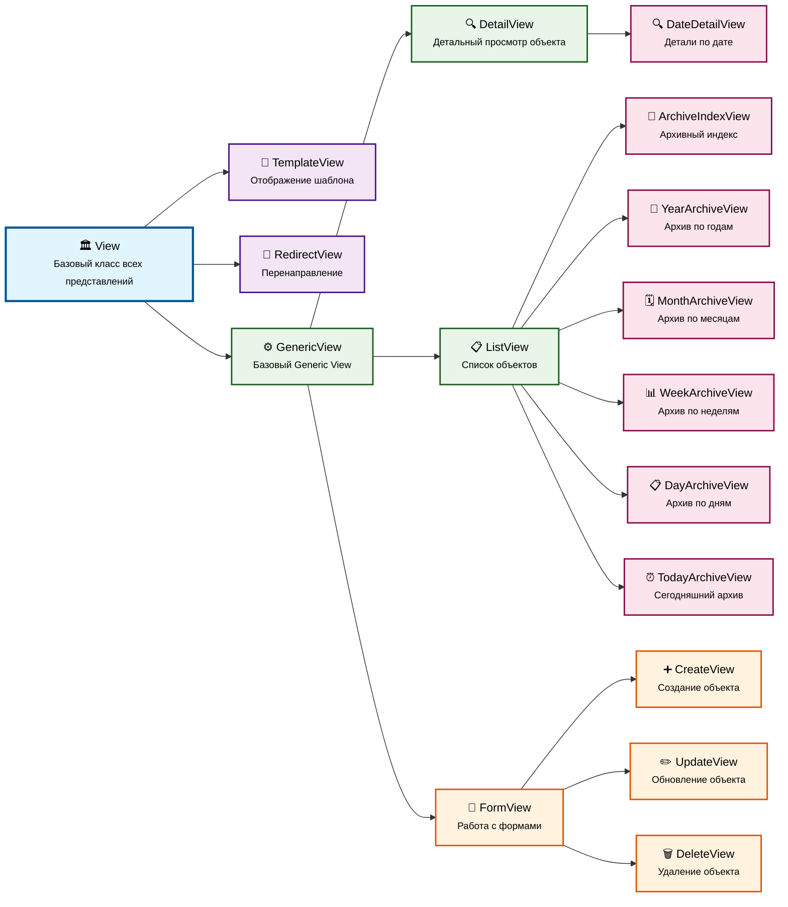
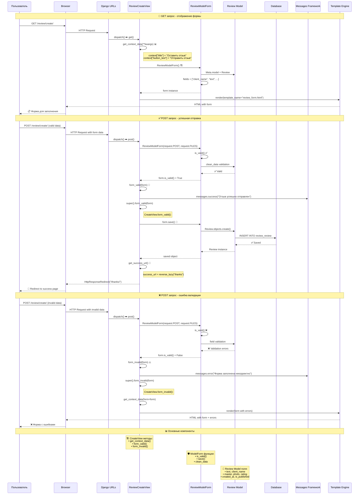

# Урок 62: Магия Django Class-Based Views (CBV)

Django Class-Based Views (CBV) — это мощный инструмент, который позволяет писать более структурированный, переиспользуемый и расширяемый код для обработки веб-запросов по сравнению с традиционными Function-Based Views (FBV). Они предоставляют набор готовых классов, которые можно наследовать и настраивать, значительно ускоряя разработку и улучшая читаемость кода.



> **Пояснение к диаграмме:**
>
> * **`View`**: Самый базовый класс. Отвечает только за диспетчеризацию запросов к методам (`get`, `post` и т.д.).
> * **Mixins**: Классы-примеси, которые добавляют конкретную функциональность.
>   * `TemplateResponseMixin`: Добавляет логику для рендеринга шаблонов.
>   * `ContextMixin`: Добавляет логику для передачи данных (контекста) в шаблон.
>   * `SingleObjectMixin`: Добавляет логику для получения одного объекта модели (`.get()`).
>   * `MultipleObjectMixin`: Добавляaет логику для получения списка объектов (`.all()`, `.filter()`).
> * **Generic Views**: Готовые к использованию классы, которые комбинируют `View` и различные миксины для решения типичных задач (показ шаблона, объекта, списка объектов).

## 1. Базовая View (`django.views.View`)

Базовый класс `View` является основой для всех Class-Based Views в Django. Он не предоставляет никакой специфической функциональности, кроме диспетчеризации HTTP-методов. Это означает, что вы можете определить методы с именами HTTP-глаголов (например, `get()`, `post()`, `put()`, `delete()`), и Django автоматически вызовет соответствующий метод в зависимости от типа входящего запроса.

### Методы

* **`get(self, request, *args, **kwargs)`**: Вызывается при получении GET-запроса.
* **`post(self, request, *args, **kwargs)`**: Вызывается при получении POST-запроса.
* **`put(self, request, *args, **kwargs)`**: Вызывается при получении PUT-запроса.
* **`delete(self, request, *args, **kwargs)`**: Вызывается при получении DELETE-запроса.
* **`dispatch(self, request, *args, **kwargs)`**: Это основной метод, который обрабатывает входящий запрос. Он определяет тип HTTP-метода и вызывает соответствующий метод (`get`, `post` и т.д.). Вы можете переопределить `dispatch` для добавления логики, которая должна выполняться независимо от HTTP-метода (например, проверки аутентификации или разрешений).

### Args и kwargs

`*args` и `**kwargs` в методах CBV (`get`, `post` и т.д.) получают свои значения из параметров, захваченных в URL-шаблоне (`urls.py`). В подавляющем большинстве случаев вы будете работать с `**kwargs`, так как Django передает захваченные из URL параметры как именованные аргументы.

Вот таблица с наиболее часто используемыми аргументами, которые передаются через `**kwargs`:

| Аргумент | Откуда берется | Описание | Пример URL-шаблона | Пример `kwargs` в View |
| :--- | :--- | :--- | :--- | :--- |
| `pk` | Из URL | **P**rimary **K**ey (первичный ключ) объекта. Используется по умолчанию в `DetailView` для поиска конкретной записи в БД. | `path('item/<int:pk>/', ...)` | `{'pk': 123}` |
| `slug` | Из URL | "Слаг" объекта — человеко-понятная часть URL. Также используется в `DetailView` как альтернатива `pk`. | `path('post/<slug:slug>/', ...)` | `{'slug': 'my-first-post'}` |
| Пользовательские параметры | Из URL | Любые другие именованные параметры, которые вы определяете в своем URL-шаблоне. | `path('archive/<int:year>/<str:month>/', ...)` | `{'year': 2024, 'month': 'july'}` |

`*args` (позиционные аргументы) используются гораздо реже, в основном при работе со старыми URL-шаблонами, использующими регулярные выражения без именованных групп. Современная практика Django — использовать именованные параметры.

### Когда будет полезна?

Базовая `View` полезна, когда вам нужна полная гибкость и контроль над обработкой запросов, и вы не хотите использовать более специализированные CBV. Она идеально подходит для:

* Создания API-эндпоинтов, где логика сильно зависит от HTTP-метода.
* Обработки сложных форм, требующих различной логики для GET и POST.
* Интеграции с внешними сервисами, где требуется специфическая обработка запросов.

### Пример из кода (`core/views.py`)

Рассмотрим `GreetingView`:

```python
# core/views.py
from django.views import View
from django.http import HttpResponse

class GreetingView(View):
    """
    Простое представление на основе базового класса View.
    Демонстрирует обработку GET и POST запросов.
    """
    greeting_get_message = "Привет, мир! Это GET запрос из GreetingView."
    greeting_post_message = "Вы успешно отправили POST запрос в GreetingView!"

    def get(self, request, *args, **kwargs):
        """
        Обрабатывает GET-запросы.
        Возвращает простое HTTP-сообщение.
        """
        return HttpResponse(self.greeting_get_message)

    def post(self, request, *args, **kwargs):
        """
        Обрабатывает POST-запросы.
        Возвращает простое HTTP-сообщение.
        """
        return HttpResponse(self.greeting_post_message)
```

> [!info]
> #### Что будет, если метод не определен? 🤔
> Важно отметить, что базовый класс `View` будет обрабатывать только те HTTP-запросы, для которых определены соответствующие методы. Если на URL, связанный с `GreetingView`, придет, например, `PUT` или `PATCH` запрос, для которых методы не определены, Django автоматически вернет ошибку **`405 Method Not Allowed`**. Это встроенное поведение обеспечивает предсказуемость и безопасность, разрешая только явно реализованные HTTP-методы.

В `core/urls.py` это представление привязано так:

```python
# core/urls.py
from django.urls import path
from .views import GreetingView

urlpatterns = [
    path("greeting/", GreetingView.as_view(), name="greeting"),
]
```

Метод `.as_view()` преобразует класс представления в вызываемую функцию, которую Django ожидает для URL-маршрутизации.

### Служебные атрибуты ⚙️

Помимо методов, у базовой `View` есть и служебные атрибуты, которые можно переопределять для тонкой настройки ее поведения.

> [!highlight]
> #### Атрибут `http_method_names`
> * **`http_method_names`**: Это атрибут **класса**, список строк, определяющий, какие HTTP-методы будет принимать данное представление. По умолчанию он включает `['get', 'post', 'put', 'patch', 'delete', 'head', 'options', 'trace']`. Вы можете ограничить этот список, чтобы представление отвечало только на определенные методы. Например, если вы хотите, чтобы ваше представление обрабатывало только `GET` и `POST` запросы, вы можете установить `http_method_names = ['get', 'post', 'head', 'options']`. Любой другой запрос получит ошибку `405 Method Not Allowed`.

> [!info]
> #### Динамические атрибуты экземпляра
> Помимо атрибутов класса, которые мы задаем заранее, метод `dispatch` устанавливает на экземпляре представления (`self`) несколько полезных атрибутов, доступных в любом методе (`get`, `post` и т.д.):
> * **`self.request`**: Полный объект `HttpRequest`, содержащий всю информацию о текущем запросе (заголовки, `GET`/`POST` параметры, текущий пользователь `request.user` и т.д.). Это самый важный атрибут, который вы будете использовать постоянно.
> * **`self.args`**: Кортеж позиционных аргументов, захваченных из URL. Используется редко.
> * **`self.kwargs`**: Словарь именованных аргументов, захваченных из URL (например, `pk` или `slug`). Это основной способ получения параметров из URL в CBV.

### PK и SLUG 🎯

Как мы уже видели в таблице выше, Django позволяет элегантно захватывать динамические части URL с помощью так называемых **конвертеров путей** (path converters), таких как `<int:pk>` и `<slug:slug>`. Давайте разберемся, как именно эти значения попадают в наше представление и как с ними работать.

#### Механизм передачи данных

Процесс передачи данных из URL в представление можно разбить на несколько шагов:

1.  **URL-маршрутизатор**: Когда пользователь запрашивает URL вроде `/item/123/`, Django находит соответствующий шаблон в `urls.py`, например, `path('item/<int:pk>/', ...)`.
2.  **Захват и конвертация**: Конвертер `<int:pk>` "понимает", что `123` — это целое число, и захватывает его, создавая именованный аргумент `pk` со значением `123`.
3.  **Вызов `dispatch`**: URL-маршрутизатор вызывает метод `.as_view()`, который, в свою очередь, создает экземпляр вашего View и вызывает его метод `dispatch`, передавая ему захваченные аргументы как `**kwargs`. То есть, `dispatch(request, pk=123)`.
4.  **Сохранение в экземпляре**: Внутри базового `View` метод `dispatch` сохраняет эти аргументы в атрибутах экземпляра: `self.request`, `self.args` и `self.kwargs`.

Таким образом, внутри любого метода вашего CBV (будь то `get`, `post` или даже переопределенный `dispatch`) вы можете безопасно получить доступ к параметрам из URL через словарь `self.kwargs`.

#### Как получить данные в View?

Самый надежный и правильный способ получить `pk` или `slug` внутри метода — это обратиться к словарю `self.kwargs`.

```python
# core/views.py (гипотетический пример)
from django.views import View
from django.http import HttpResponse
from .models import Master # Предположим, у нас есть модель Master

class MasterDetailView(View):
    def get(self, request, *args, **kwargs):
        # Получаем pk из self.kwargs, который был установлен в dispatch()
        master_id = self.kwargs.get('pk')

        if not master_id:
            return HttpResponse("ID мастера не указан.", status=400)

        try:
            # Используем pk для получения объекта из базы данных
            master = Master.objects.get(pk=master_id)
            return HttpResponse(f"Вы просматриваете мастера: {master.first_name} {master.last_name} (ID: {master_id})")
        except Master.DoesNotExist:
            return HttpResponse(f"Мастер с ID {master_id} не найден.", status=404)

```

И соответствующий `urls.py`:

```python
# core/urls.py
from django.urls import path
from .views import MasterDetailView

urlpatterns = [
    # ...
    path("master/<int:pk>/", MasterDetailView.as_view(), name="master_detail_view"),
]
```

> [!warning]
> #### `kwargs` в методе vs `self.kwargs`
> Хотя вы можете получить доступ к параметрам URL и через аргумент `kwargs` в сигнатуре метода (например, `def get(self, request, *args, **kwargs):`), использование `self.kwargs` считается более надежной практикой. Это связано с тем, что `self.kwargs` гарантированно устанавливается методом `dispatch` и доступен во всех методах представления, что делает код более консистентным и предсказуемым.

Этот подход является основой для более сложных представлений, таких как `DetailView`, которые инкапсулируют эту логику получения объекта по `pk` или `slug` внутри себя.

## 2. TemplateView (`django.views.generic.TemplateView`)

`TemplateView` — это специализированный CBV, предназначенный для отображения статических страниц или страниц, которые требуют минимальной логики для формирования контекста. Это отличная замена для простых Function-Based Views, которые просто рендерят шаблон.

### Атрибуты

* **`template_name`**: **Обязательный** атрибут, указывающий имя шаблона, который будет отображен.
* **`extra_context`**: Словарь, содержащий статические данные, которые будут добавлены в контекст шаблона.

### Расширяемые методы

* **`get_context_data(self, **kwargs)`**: Метод для добавления динамического контекста в шаблон. Он должен возвращать словарь. Важно вызвать `super().get_context_data(**kwargs)`, чтобы получить базовый контекст от родительского класса.
* **`get_template_names(self)`**: Позволяет динамически определять имя шаблона на основе логики. Если не переопределен, используется `template_name`.
* **`dispatch(self, request, *args, **kwargs)`**: Как и в базовой `View`, может быть переопределен для выполнения логики до вызова `get()` (или других методов HTTP).

### Когда будет полезна?

* Для страниц "О нас", "Контакты", "Политика конфиденциальности" и других статических страниц.
* Для страниц, где контекст формируется из нескольких простых источников или не требует сложной логики запросов к БД.

### Примеры из кода (`core/views.py`)

#### Пример 1: Простой `TemplateView` (`SimplePageView`)

```python
# core/views.py
from django.views.generic import TemplateView

class SimplePageView(TemplateView):
    """
    Простейшее представление для отображения статической страницы.
    Использует атрибут template_name для указания шаблона.
    """
    template_name = "core/simple_page.html"
```

В `core/urls.py`:

```python
# core/urls.py
from django.urls import path
from .views import SimplePageView

urlpatterns = [
    path("simple-page/", SimplePageView.as_view(), name="simple_page"),
]
```

Это "View в 2 строки", так как все, что нужно, это указать имя шаблона.

#### Пример 2: `TemplateView` с дополнительным контекстом (`AboutUsView`)

```python
# core/views.py
from django.views.generic import TemplateView
import datetime # Импортируем datetime для динамического контекста

class AboutUsView(TemplateView):
    """
    Представление для страницы "О нас".
    Демонстрирует передачу как статического, так и динамического контекста в шаблон
    через переопределение метода get_context_data().
    """
    template_name = "core/about_us.html"

    def get_context_data(self, **kwargs):
        """
        Формирует и возвращает словарь контекста для шаблона.
        """
        context = super().get_context_data(**kwargs)
        
        context['company_name'] = "Барбершоп 'Арбуз'"
        context['start_year'] = 2010
        context['current_year'] = datetime.date.today().year
        context['years_on_market'] = datetime.date.today().year - context['start_year']
        context['page_title'] = "О нас - Барбершоп 'Арбуз'"
        context['contact_email'] = "contact@arbuz-barbershop.com"
        
        return context
```

В `core/urls.py`:

```python
# core/urls.py
from django.urls import path
from .views import AboutUsView

urlpatterns = [
    path("about-us/", AboutUsView.as_view(), name="about_us"),
]
```

Здесь `get_context_data` используется для добавления как статических (`company_name`), так и динамически вычисляемых (`years_on_market`) данных в контекст шаблона.

#### Пример 3: Переписывание существующего FBV на `TemplateView` (`ThanksView`)

Изначально `thanks` мог быть Function-Based View, но его переписали на `TemplateView` для лучшей структурированности:

```python
# core/views.py
from django.views.generic import TemplateView
from django.db.models import Count # Для masters_count
from .models import Master # Для masters_count

class ThanksView(TemplateView):
    template_name = "core/thanks.html"

    def get_context_data(self, **kwargs):
        context = super().get_context_data(**kwargs)
        
        masters_count = Master.objects.filter(is_active=True).count()
        context["masters_count"] = masters_count
        context["additional_message"] = "Спасибо, что выбрали наш первоклассный сервис!"
        
        if 'source' in kwargs:
            source_page = kwargs['source']
            if source_page == 'order':
                context['source_message'] = "Ваш заказ успешно создан и принят в обработку."
            elif source_page == 'review':
                context['source_message'] = "Ваш отзыв успешно отправлен и будет опубликован после модерации."
            else:
                context['source_message'] = f"Благодарим вас за ваше действие, инициированное со страницы: {source_page}."
        else:
            context['source_message'] = "Благодарим вас за посещение!"
            
        return context
```

В `core/urls.py`:

```python
# core/urls.py
from django.urls import path
from .views import ThanksView

urlpatterns = [
    path("thanks/", ThanksView.as_view(), name="thanks"),
    path("thanks/<str:source>/", ThanksView.as_view(), name="thanks_with_source"),
]
```

Здесь `get_context_data` также используется для добавления динамических данных (количество активных мастеров) и обработки параметров URL (`source`).

## 3. DetailView (`django.views.generic.DetailView`)

`DetailView` предназначен для отображения детальной информации об одном конкретном объекте из базы данных. Он автоматически извлекает объект на основе первичного ключа (PK) или slug, переданного в URL.

### Атрибуты

* **`model`**: **Обязательный** атрибут, указывающий модель, из которой будет извлекаться объект.
* **`template_name`**: Имя шаблона для отображения. Если не указано, Django по умолчанию ищет шаблон по пути `<app_label>/<model_name_lowercase>_detail.html` (например, `core/order_detail.html`).
* **`pk_url_kwarg`**: Имя именованного аргумента URL, который содержит первичный ключ объекта. По умолчанию `'pk'`. Если в URL используется другое имя (например, `order_id`), его нужно указать здесь.
* **`slug_url_kwarg`**: Имя именованного аргумента URL, который содержит slug объекта. По умолчанию `'slug'`.
* **`slug_field`**: Имя поля модели, которое содержит slug. По умолчанию `'slug'`.
* **`context_object_name`**: Имя переменной, под которой объект будет доступен в контексте шаблона. По умолчанию это имя модели в нижнем регистре (например, `order` для модели `Order`).
* **`extra_context`**: Словарь со статическими данными для добавления в контекст.

### Методы

* **`get_queryset(self)`**: Возвращает QuerySet, из которого будет извлекаться объект. Полезно для добавления фильтрации, `select_related` или `prefetch_related` для оптимизации запросов.
* **`get_object(self, queryset=None)`**: Возвращает конкретный объект для отображения. Если нужно изменить логику получения объекта (например, получить его не по PK/slug, а по другим параметрам), можно переопределить этот метод.
* **`get_context_data(self, **kwargs)`**: Возвращает контекст для шаблона. Используется для добавления дополнительных данных, не связанных напрямую с основным объектом.

### Защита представлений

#### Как защитить от неавторизованных пользователей?

Используйте `LoginRequiredMixin` из `django.contrib.auth.mixins`. Этот миксин перенаправит неавторизованных пользователей на страницу входа.

```python
# core/views.py
from django.contrib.auth.mixins import LoginRequiredMixin
from django.views.generic import DetailView
from .models import Order

class OrderDetailView(LoginRequiredMixin, DetailView):
    model = Order
    template_name = "core/order_detail.html"
    pk_url_kwarg = "order_id"  # Указываем, что pk будет извлекаться из order_id в URL
```

#### Как защитить от НЕ `is_staff`?

Есть два основных варианта:

1. **Использовать `UserPassesTestMixin`**: Этот миксин позволяет определить метод `test_func()`, который возвращает `True` или `False`. Если `False`, вызывается `handle_no_permission()`.

    ```python
    # core/views.py
    from django.contrib.auth.mixins import UserPassesTestMixin
    from django.shortcuts import redirect
    from django.contrib import messages

    class StaffRequiredMixin(UserPassesTestMixin):
        """
        Миксин для проверки, является ли пользователь сотрудником (is_staff).
        Если проверка не пройдена, пользователь перенаправляется на главную страницу
        с сообщением об ошибке.
        """
        def test_func(self):
            # Проверяем, аутентифицирован ли пользователь и является ли он сотрудником
            return self.request.user.is_authenticated and self.request.user.is_staff

        def handle_no_permission(self):
            # Этот метод вызывается, если test_func вернул False
            messages.error(self.request, "У вас нет доступа к этому разделу.")
            return redirect("landing") # Предполагаем, что 'landing' - это имя URL главной страницы
    ```

    Затем вы можете использовать этот миксин в своих CBV:

    ```python
    # core/views.py
    class OrderDetailView(LoginRequiredMixin, StaffRequiredMixin, DetailView):
        model = Order
        template_name = "core/order_detail.html"
        pk_url_kwarg = "order_id"
    ```

2. **Переопределить метод `dispatch`**: Вы можете добавить логику проверки прямо в метод `dispatch` вашего представления.

    ```python
    # core/views.py
    from django.contrib.auth.mixins import LoginRequiredMixin
    from django.views.generic import DetailView
    from django.shortcuts import redirect
    from django.contrib import messages
    # from django.http import Http403 # Можно импортировать для Http403
    
    class OrderDetailView(LoginRequiredMixin, DetailView):
        model = Order
        template_name = "core/order_detail.html"
        pk_url_kwarg = "order_id"
    
        def dispatch(self, request, *args, **kwargs):
            # Сначала проверяем, аутентифицирован ли пользователь (это делает LoginRequiredMixin,
            # но если бы его не было, проверка была бы здесь: if not request.user.is_authenticated:)
            # Затем проверяем, является ли пользователь сотрудником
            if not request.user.is_staff:
                messages.error(request, "У вас нет доступа к этой странице.")
                return redirect("landing") 
                # Или можно было бы вызвать Http403: from django.http import Http403; raise Http403("Доступ запрещен")
            
            # Если все проверки пройдены, вызываем родительский метод dispatch,
            # который уже вызовет get(), post() и т.д.
            return super().dispatch(request, *args, **kwargs)
    ```

### Примеры из кода (`core/views.py`)

#### `OrderDetailView`

```python
# core/views.py
from django.contrib.auth.mixins import LoginRequiredMixin
from django.views.generic import DetailView
from .models import Order
from django.shortcuts import redirect
from django.contrib import messages

class OrderDetailView(LoginRequiredMixin, DetailView):
    model = Order
    template_name = "core/order_detail.html"
    pk_url_kwarg = "order_id"

    def dispatch(self, request, *args, **kwargs):
        if not request.user.is_staff:
            messages.error(request, "У вас нет доступа к этой странице.")
            return redirect("landing") 
        return super().dispatch(request, *args, **kwargs)
```

В `core/urls.py`:

```python
# core/urls.py
from django.urls import path
from .views import OrderDetailView

urlpatterns = [
    path("orders/<int:order_id>/", OrderDetailView.as_view(), name="order_detail"),
]
```

Здесь `pk_url_kwarg` явно указывает, что первичный ключ будет извлекаться из параметра `order_id` в URL. Метод `dispatch` используется для проверки прав доступа пользователя (`is_staff`).

#### `ServiceDetailView`

```python
# core/views.py
from django.views.generic import DetailView
from .models import Service

class ServiceDetailView(DetailView):
    """
    Представление для отображения детальной информации об услуге.
    Использует модель Service и явно указанное имя шаблона.
    В шаблон будет передан объект service (имя по умолчанию для контекстной переменной).
    """
    model = Service
    template_name = 'core/service_detail.html'
```

В `core/urls.py`:

```python
# core/urls.py
from django.urls import path
from .views import ServiceDetailView

urlpatterns = [
    path("service/<int:pk>/", ServiceDetailView.as_view(), name="service_detail"),
]
```

Здесь используется стандартное имя параметра `pk` в URL, поэтому `pk_url_kwarg` не требуется.

## 4. ListView (`django.views.generic.ListView`)

`ListView` предназначен для отображения списка объектов из базы данных. Он предоставляет функциональность для получения QuerySet, пагинации и добавления контекста.

### Атрибуты

* **`model`**: **Обязательный** атрибут, указывающий модель, объекты которой будут отображаться.
* **`queryset`**: Можно явно указать QuerySet вместо `model`. Если указан, `model` игнорируется.
* **`template_name`**: Имя шаблона для отображения. По умолчанию Django ищет шаблон по пути `<app_label>/<model_name_lowercase>_list.html` (например, `core/order_list.html`).
* **`context_object_name`**: Имя переменной, под которой список объектов будет доступен в контексте шаблона. По умолчанию это `object_list`.
* **`paginate_by`**: Целое число, указывающее количество объектов на страницу для пагинации.
* **`ordering`**: Список строк или кортеж, указывающий порядок сортировки QuerySet. Например, `['name', '-price']`.
* **`extra_context`**: Словарь со статическими данными для добавления в контекст.

### Методы

* **`get_queryset(self)`**: Возвращает QuerySet объектов для отображения. Это наиболее часто переопределяемый метод для добавления фильтрации, поиска, сортировки или оптимизации запросов (`select_related`, `prefetch_related`).
* **`get_context_data(self, **kwargs)`**: Возвращает контекст для шаблона. Используется для добавления дополнительных данных, не связанных напрямую со списком объектов (например, заголовки, счетчики).

### Примеры из кода (`core/views.py`)

#### `ServicesListView`

Это представление заменяет Function-Based View `services_list`.

```python
# core/views.py
from django.contrib.auth.mixins import UserPassesTestMixin, LoginRequiredMixin
from django.views.generic import ListView
from .models import Service
from django.shortcuts import redirect
from django.contrib import messages

class StaffRequiredMixin(UserPassesTestMixin):
    def test_func(self):
        return self.request.user.is_authenticated and self.request.user.is_staff

    def handle_no_permission(self):
        messages.error(self.request, "У вас нет доступа к этому разделу.")
        return redirect("landing")

class ServicesListView(StaffRequiredMixin, ListView):
    model = Service
    template_name = "core/services_list.html"
    context_object_name = "services"
    extra_context = {
        "title": "Управление услугами",
    }
```

В `core/urls.py`:

```python
# core/urls.py
from django.urls import path
from .views import ServicesListView

urlpatterns = [
    path("services/", ServicesListView.as_view(), name="services_list"),
]
```

Здесь используется `StaffRequiredMixin` для ограничения доступа только для сотрудников. `context_object_name` установлен в `'services'`, чтобы в шаблоне можно было обращаться к списку как `{{ services }}`. `extra_context` добавляет статический заголовок.

#### `OrdersListView`

Это представление заменяет Function-Based View `orders_list` и включает сложную логику поиска и фильтрации.

```python
# core/views.py
from django.contrib.auth.mixins import UserPassesTestMixin, LoginRequiredMixin
from django.views.generic import ListView
from .models import Order, Master, Service # Убедитесь, что все модели импортированы
from django.db.models import Q, F # Для Q-объектов и F-выражений
from django.shortcuts import redirect
from django.contrib import messages

class StaffRequiredMixin(UserPassesTestMixin):
    def test_func(self):
        return self.request.user.is_authenticated and self.request.user.is_staff

    def handle_no_permission(self):
        messages.error(self.request, "У вас нет доступа к этому разделу.")
        return redirect("landing")

class OrdersListView(StaffRequiredMixin, ListView):
    model = Order
    template_name = "core/orders_list.html"
    context_object_name = "orders"

    def get_queryset(self):
        """
        Переопределяем метод get_queryset для получения всех заказов с жадной загрузкой мастеров и услуг.
        А так же обработкой всех вариантов фильтрации и поиска.
        """
        all_orders = (
            Order.objects.select_related("master").prefetch_related("services").all()
        )

        search_query = self.request.GET.get("search", None)

        if search_query:
            check_boxes = self.request.GET.getlist("search_in")
            filters = Q()

            if "phone" in check_boxes:
                filters |= Q(phone__icontains=search_query)
            if "name" in check_boxes:
                filters |= Q(client_name__icontains=search_query)
            if "comment" in check_boxes:
                filters |= Q(comment__icontains=search_query)

            if filters:
                all_orders = all_orders.filter(filters)

        return all_orders
```

В `core/urls.py`:

```python
# core/urls.py
from django.urls import path
from .views import OrdersListView

urlpatterns = [
    path("orders/", OrdersListView.as_view(), name="orders_list"),
]
```

Здесь `get_queryset` переопределен для реализации логики поиска и фильтрации, которая ранее была в Function-Based View. Используются `select_related` и `prefetch_related` для оптимизации запросов к базе данных, что является хорошей практикой при работе со связанными объектами.

## Заключение

Class-Based Views в Django предоставляют мощный и гибкий способ организации логики представлений. Используя базовые `View`, `TemplateView`, `DetailView` и `ListView`, а также различные миксины, разработчики могут создавать чистый, переиспользуемый и легко поддерживаемый код. Понимание их атрибутов и методов позволяет эффективно настраивать поведение представлений под конкретные нужды проекта, значительно повышая продуктивность разработки.

В этом уроке мы углубимся в Class-Based Views, которые значительно упрощают работу с формами и объектами базы данных: `CreateView` для создания новых записей, `UpdateView` для их редактирования, а также мощный `FormMixin`, который лежит в основе многих CBV, связанных с формами.

## 1. CreateView (`django.views.generic.edit.CreateView`)

`CreateView` — это универсальное представление для создания нового экземпляра модели с помощью формы. Оно автоматически обрабатывает отображение пустой формы (GET-запрос) и сохранение данных после успешной отправки (POST-запрос).

### Атрибуты

* **`model`**: **Обязательный** атрибут, указывающий модель, для которой будет создаваться новый объект. Если форма связана с моделью, модель можно не указывать.
* **`form_class`**: Класс формы, который будет использоваться для создания объекта. Если не указан, Django попытается автоматически создать `ModelForm` на основе `model` и `fields`.
* **`fields`**: Список полей модели, которые должны быть включены в форму. Используется, если `form_class` не указан. **Важно: Никогда не используйте `__all__` в продакшене без явной причины, так как это может привести к уязвимостям безопасности.**
* **`template_name`**: Имя шаблона для отображения формы. По умолчанию Django ищет шаблон по пути `<app_label>/<model_name_lowercase>_form.html` (например, `core/order_form.html`).
* **`success_url`**: URL, на который пользователь будет перенаправлен после успешного создания объекта. Рекомендуется использовать `django.urls.reverse_lazy` для отложенного разрешения URL.
* **`extra_context`**: Словарь со статическими данными для добавления в контекст шаблона.

### Методы

* **`form_valid(self, form)`**: Вызывается, когда форма успешно прошла валидацию. По умолчанию сохраняет объект и перенаправляет на `success_url`. Вы можете переопределить этот метод, чтобы добавить дополнительную логику перед сохранением (например, установить текущего пользователя как автора объекта).
* **`form_invalid(self, form)`**: Вызывается, когда форма не прошла валидацию. По умолчанию повторно отображает форму с ошибками. Вы можете переопределить этот метод, чтобы добавить дополнительную логику (например, логирование ошибок).
* **`get_form_class(self)`**: Позволяет динамически определить класс формы.
* **`get_initial(self)`**: Возвращает словарь с начальными данными для формы.
* **`get_form_kwargs(self)`**: Возвращает словарь аргументов, которые будут переданы в конструктор формы.
* **`get_success_url(self)`**: Позволяет динамически определить URL для перенаправления после успешного создания.

### Когда будет полезна?

`CreateView` идеально подходит для любых страниц, где пользователю нужно добавить новую запись в базу данных:

* Страница регистрации нового заказа (`Order`).
* Форма добавления новой услуги (`Service`).
* Форма создания нового мастера (`Master`).
* Форма написания отзыва (`Review`).

### Диаграмма



### Фантазии по применению в нашем коде

В нашем проекте уже есть Function-Based Views для создания заказа (`order_create`) и услуги (`service_create`). Мы могли бы переписать их на `CreateView`, чтобы сделать код более лаконичным и соответствующим паттернам Django.

Например, для создания услуги:

```python
# core/views.py (гипотетический пример)
from django.views.generic.edit import CreateView
from .models import Service
from .forms import ServiceForm
from django.urls import reverse_lazy
from django.contrib.auth.mixins import LoginRequiredMixin, UserPassesTestMixin
from django.contrib import messages
from django.shortcuts import redirect

# Используем уже существующий StaffRequiredMixin
class StaffRequiredMixin(UserPassesTestMixin):
    def test_func(self):
        return self.request.user.is_authenticated and self.request.user.is_staff
    def handle_no_permission(self):
        messages.error(self.request, "У вас нет доступа к этому разделу.")
        return redirect("landing")

class ServiceCreateView(StaffRequiredMixin, CreateView):
    model = Service
    form_class = ServiceForm # Используем нашу существующую форму
    template_name = "core/service_form.html" # Шаблон для формы
    success_url = reverse_lazy("services_list") # Перенаправляем на список услуг

    def get_context_data(self, **kwargs):
        context = super().get_context_data(**kwargs)
        context["title"] = "Создание услуги"
        context["button_txt"] = "Создать"
        return context

    def form_valid(self, form):
        # Здесь можно добавить логику, например, установить автора услуги
        # form.instance.created_by = self.request.user
        messages.success(self.request, f"Услуга '{form.cleaned_data['name']}' успешно создана!")
        return super().form_valid(form)
```

И в `core/urls.py`:

```python
# core/urls.py (гипотетический пример)
from django.urls import path
from .views import ServiceCreateView

urlpatterns = [
    path("service_create_cbv/", ServiceCreateView.as_view(), name="service_create_cbv"),
]
```

Это значительно сократило бы код по сравнению с Function-Based View, убрав ручную обработку GET/POST запросов и валидации формы.

```python
    def get_form_class(self):
        """
        Обрабатывает параметр form_mode в URL и возвращает нужную форму
        2 варианта: "normal" и "easy"
        """
        form_mode = self.kwargs.get("form_mode")
        if form_mode == "normal":
            return ServiceForm
        
        elif form_mode == "easy":
            return ServiceEasyForm
```

Позволит в зависимости от параметра в URL использовать разные формы.

## 2. UpdateView (`django.views.generic.edit.UpdateView`)

`UpdateView` — это представление для редактирования существующего экземпляра модели. Оно автоматически загружает объект (GET-запрос), отображает форму с предзаполненными данными и сохраняет изменения после успешной отправки (POST-запрос).

### Атрибуты

* **`model`**: **Обязательный** атрибут, указывающий модель, объект которой будет редактироваться.
* **`form_class`**: Класс формы, который будет использоваться. Если не указан, Django автоматически создаст `ModelForm`.
* **`fields`**: Список полей модели для формы, если `form_class` не указан.
* **`template_name`**: Имя шаблона для отображения формы. По умолчанию Django ищет шаблон по пути `<app_label>/<model_name_lowercase>_form.html`.
* **`pk_url_kwarg`**: Имя именованного аргумента URL для первичного ключа. По умолчанию `'pk'`.
* **`slug_url_kwarg`**: Имя именованного аргумента URL для slug. По умолчанию `'slug'`.
* **`success_url`**: URL для перенаправления после успешного обновления.
* **`context_object_name`**: Имя переменной, под которой объект будет доступен в контексте шаблона. По умолчанию это имя модели в нижнем регистре.
* **`extra_context`**: Словарь со статическими данными для добавления в контекст.

### Методы

* **`form_valid(self, form)`**: Вызывается, когда форма успешно прошла валидацию. По умолчанию сохраняет изменения и перенаправляет.
* **`get_object(self, queryset=None)`**: Возвращает объект, который будет редактироваться. Можно переопределить для кастомной логики получения объекта.
* **`get_form_class(self)`**, **`get_initial(self)`**, **`get_form_kwargs(self)`**, **`get_success_url(self)`**: Аналогичны методам в `CreateView`.

### Когда будет полезна?

`UpdateView` идеально подходит для страниц, где пользователю нужно изменить существующую запись:

* Страница редактирования данных заказа (`Order`).
* Форма редактирования существующей услуги (`Service`).
* Форма обновления информации о мастере (`Master`).
* Модерация и редактирование отзыва (`Review`).

### Фантазии по применению в нашем коде

У нас есть Function-Based View `service_update`. Его также можно было бы переписать на `UpdateView`.

```python
# core/views.py (гипотетический пример)
from django.views.generic.edit import UpdateView
from .models import Service
from .forms import ServiceForm
from django.urls import reverse_lazy
from django.contrib.auth.mixins import LoginRequiredMixin, UserPassesTestMixin
from django.contrib import messages
from django.shortcuts import redirect

# Используем уже существующий StaffRequiredMixin
class StaffRequiredMixin(UserPassesTestMixin):
    def test_func(self):
        return self.request.user.is_authenticated and self.request.user.is_staff
    def handle_no_permission(self):
        messages.error(self.request, "У вас нет доступа к этому разделу.")
        return redirect("landing")

class ServiceUpdateView(StaffRequiredMixin, UpdateView):
    model = Service
    form_class = ServiceForm
    template_name = "core/service_form.html"
    pk_url_kwarg = "service_id" # Указываем, что PK берется из service_id в URL
    success_url = reverse_lazy("services_list")

    def get_context_data(self, **kwargs):
        context = super().get_context_data(**kwargs)
        context["title"] = f"Редактирование услуги {self.object.name}"
        context["button_txt"] = "Обновить"
        return context

    def form_valid(self, form):
        messages.success(self.request, f"Услуга '{form.cleaned_data['name']}' успешно обновлена!")
        return super().form_valid(form)
```

И в `core/urls.py`:

```python
# core/urls.py (гипотетический пример)
from django.urls import path
from .views import ServiceUpdateView

urlpatterns = [
    path("service_update_cbv/<int:service_id>/", ServiceUpdateView.as_view(), name="service_update_cbv"),
]
```

Это также значительно упрощает код, так как `UpdateView` берет на себя всю рутину по загрузке объекта, предзаполнению формы и сохранению изменений.

## 3. FormMixin (`django.views.generic.edit.FormMixin`)

`FormMixin` — это миксин, который предоставляет базовую функциональность для работы с формами в Class-Based Views. Он не является полноценным представлением сам по себе, но добавляет необходимые методы и атрибуты для обработки форм. `CreateView` и `UpdateView` (а также `FormView`) наследуют от `FormMixin`.

### Что он может дать?

`FormMixin` предоставляет:

* **Атрибуты для настройки формы**: `form_class`, `initial`, `success_url`.
* **Методы для обработки формы**:
  * `get_form(self, form_class=None)`: Возвращает экземпляр формы.
  * `get_form_class(self)`: Определяет класс формы.
  * `get_form_kwargs(self)`: Возвращает аргументы для конструктора формы.
  * `get_initial(self)`: Возвращает начальные данные для формы.
  * `form_valid(self, form)`: Обрабатывает успешно валидированную форму.
  * `form_invalid(self, form)`: Обрабатывает невалидную форму.
  * `get_success_url(self)`: Определяет URL для перенаправления после успешной обработки.

Основное преимущество `FormMixin` в том, что он позволяет добавить функциональность формы к любому другому CBV. Например, вы можете объединить его с `DetailView`, чтобы отображать форму на странице с деталями объекта.

### Пример: Добавление комментариев на детальной странице заявки (`OrderDetailView`)

Представим, что мы хотим добавить возможность сотрудникам оставлять комментарии к заявкам прямо на странице деталей заказа. У нас уже есть `OrderDetailView`, который отображает информацию о заказе. Мы можем использовать `FormMixin` для добавления формы комментария.

Для этого нам понадобится:

1. **Модель для комментариев**: Допустим, `Comment` с полями `text`, `order` (ForeignKey к `Order`), `author` (ForeignKey к `User`).
2. **Форма для комментариев**: `CommentForm`, основанная на модели `Comment`.

#### Реализация без `FormMixin` (Function-Based View подход внутри CBV)

Если бы мы не использовали `FormMixin`, нам пришлось бы вручную обрабатывать форму в методе `post` нашего `OrderDetailView`:

```python
# core/views.py (гипотетический пример без FormMixin)
from django.views.generic import DetailView
from django.contrib.auth.mixins import LoginRequiredMixin, UserPassesTestMixin
from django.shortcuts import redirect
from django.contrib import messages
# from .models import Order, Comment # Предполагаем, что Comment существует
# from .forms import CommentForm # Предполагаем, что CommentForm существует

class OrderDetailView(LoginRequiredMixin, UserPassesTestMixin, DetailView):
    # ... (существующие атрибуты и методы) ...
    # model = Order
    # template_name = "core/order_detail.html"
    # pk_url_kwarg = "order_id"

    def test_func(self):
        return self.request.user.is_authenticated and self.request.user.is_staff

    def handle_no_permission(self):
        messages.error(self.request, "У вас нет доступа к этой странице.")
        return redirect("landing")

    def get_context_data(self, **kwargs):
        context = super().get_context_data(**kwargs)
        # Добавляем пустую форму комментария для GET-запроса
        context['comment_form'] = CommentForm()
        context['comments'] = self.object.comments.all().order_by('-created_at') # Если у Order есть related_name 'comments'
        return context

    def post(self, request, *args, **kwargs):
        self.object = self.get_object() # Получаем текущий объект Order
        comment_form = CommentForm(request.POST) # Создаем форму из POST-данных

        if comment_form.is_valid():
            comment = comment_form.save(commit=False)
            comment.order = self.object
            comment.author = request.user
            comment.save()
            messages.success(request, "Комментарий успешно добавлен!")
            return redirect(self.object.get_absolute_url()) # Перенаправляем на ту же страницу
        else:
            messages.error(request, "Ошибка при добавлении комментария.")
            context = self.get_context_data() # Получаем контекст, чтобы передать форму с ошибками
            context['comment_form'] = comment_form
            return self.render_to_response(context) # Рендерим шаблон с ошибками
```

Этот подход требует ручной обработки формы, включая создание экземпляра формы, проверку валидации, сохранение и рендеринг шаблона с ошибками.

#### Реализация с `FormMixin`

Используя `FormMixin`, мы можем значительно упростить эту логику, делегировав большую часть работы миксину:

```python
# core/views.py (гипотетический пример с FormMixin)
from django.views.generic import DetailView
from django.views.generic.edit import FormMixin # Импортируем FormMixin
from django.contrib.auth.mixins import LoginRequiredMixin, UserPassesTestMixin
from django.shortcuts import redirect
from django.contrib import messages
from django.urls import reverse # Для get_success_url

# from .models import Order, Comment # Предполагаем, что Comment существует
# from .forms import CommentForm # Предполагаем, что CommentForm существует

class OrderDetailWithCommentView(LoginRequiredMixin, UserPassesTestMixin, FormMixin, DetailView):
    model = Order
    template_name = "core/order_detail.html"
    pk_url_kwarg = "order_id"
    # Добавляем атрибуты FormMixin
    form_class = CommentForm # Класс формы для комментария
    success_url = "/" # Временно, будет переопределен в get_success_url

    def test_func(self):
        return self.request.user.is_authenticated and self.request.user.is_staff

    def handle_no_permission(self):
        messages.error(self.request, "У вас нет доступа к этой странице.")
        return redirect("landing")

    def get_context_data(self, **kwargs):
        context = super().get_context_data(**kwargs)
        # Передаем форму в контекст. FormMixin предоставляет get_form()
        context['comment_form'] = self.get_form()
        # context['comments'] = self.object.comments.all().order_by('-created_at')
        return context

    def post(self, request, *args, **kwargs):
        # Получаем объект Order, к которому добавляем комментарий
        self.object = self.get_object()
        # Создаем форму, используя методы FormMixin
        form = self.get_form()

        if form.is_valid():
            return self.form_valid(form)
        else:
            return self.form_invalid(form)

    def form_valid(self, form):
        # comment = form.save(commit=False)
        # comment.order = self.object
        # comment.author = self.request.user # Текущий пользователь
        # comment.save()
        messages.success(self.request, "Комментарий успешно добавлен!")
        return super().form_valid(form) # Вызываем родительский form_valid для перенаправления

    def get_success_url(self):
        # После успешного добавления комментария, перенаправляем на ту же страницу деталей заказа
        return reverse("order_detail", kwargs={"order_id": self.object.pk})
```

В этом примере `FormMixin` берет на себя большую часть работы по инициализации формы, ее валидации и обработке успешного сохранения. Мы переопределяем `post` для вызова `form.is_valid()`, а затем `form_valid` или `form_invalid`. `get_context_data` используется для передачи формы в шаблон, а `get_success_url` для определения, куда перенаправить пользователя после успешной отправки. Это делает код более чистым и модульным.

## Заключение

`CreateView` и `UpdateView` являются мощными инструментами для быстрой реализации CRUD-операций в Django, значительно сокращая объем шаблонного кода. `FormMixin` же предоставляет гибкость для добавления функциональности форм к любым другим Class-Based Views, позволяя создавать сложные, но при этом чистые и поддерживаемые представления. Понимание этих компонентов позволяет эффективно строить интерактивные веб-приложения на Django.
