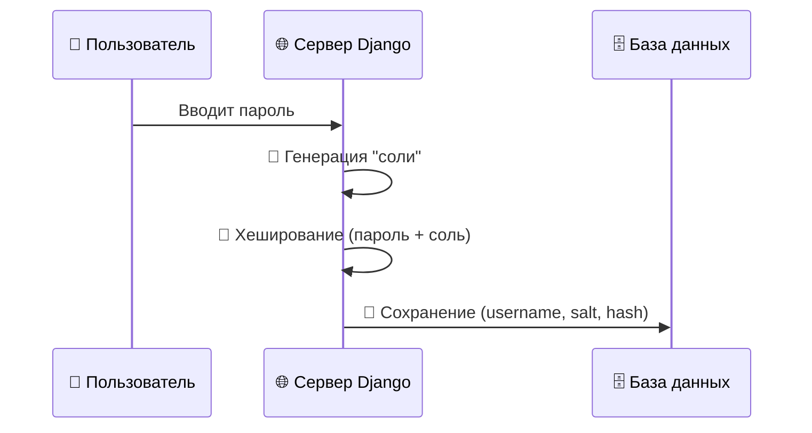
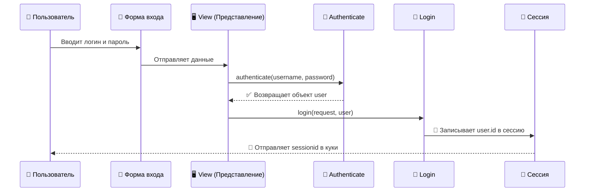
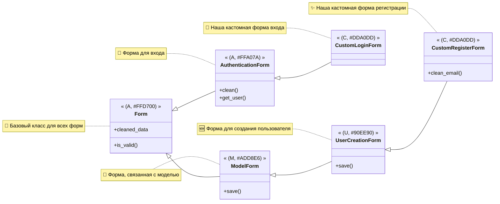
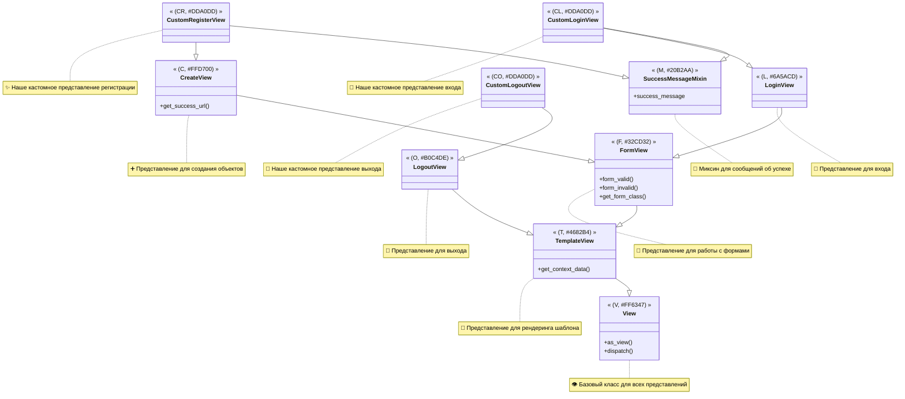

# Lesson 66.2 Работа с пользователями в Django 👤

## Модель User - стандартная модель в БД `auth_user` 📖

Гибкость Django проявляется в том, что, хотя стандартная модель `User` подходит для большинства сценариев, разработчики не ограничены только ею. При необходимости можно расширить стандартную модель, добавив к ней дополнительные поля через профильную модель, связанную отношением "один-к-одному", или даже полностью заменить её на собственную, унаследовав от `AbstractUser` или `AbstractBaseUser`.

Такой подход позволяет создавать сложные пользовательские модели с уникальными полями и методами, полностью адаптированные под нужды конкретного проекта, будь то социальная сеть с аватарами и датами рождения или корпоративная система с должностями и отделами.

Тем не менее, для многих проектов, особенно на начальном этапе, стандартной модели `User` более чем достаточно, и она служит прекрасной отправной точкой для построения системы управления пользователями. Понимание её структуры и возможностей является ключевым для любого Django-разработчика, так как это основа для реализации безопасной и функциональной аутентификации и авторизации.

В Django встроена мощная система аутентификации, и центральное место в ней занимает модель `User`. Эта модель по умолчанию хранится в таблице базы данных с именем `auth_user` и предоставляет основной набор полей для работы с пользователями: `username`, `password`, `email`, `first_name`, `last_name` и несколько других. Эта готовая структура значительно ускоряет разработку, избавляя от необходимости создавать базовую логику управления пользователями с нуля.

> [!info]
>
> #### Что такое модель `User`?
>
> Это стандартная, готовая к использованию модель Django, которая содержит основную информацию о пользователе. Она является частью фреймворка `django.contrib.auth` и тесно интегрирована со всей системой аутентификации и авторизации.

### Хеширование паролей 🔑

Кроме того, Django добавляет к каждому паролю так называемую "соль" (salt) — случайную строку, которая делает хеши уникальными даже для одинаковых паролей. Это защищает от атак с использованием "радужных таблиц" (pre-computed tables of hashes). Таким образом, даже если два пользователя выберут одинаковый пароль, их хеши в базе данных будут абсолютно разными, что значитель—о повышает планку безопасности.

Процесс также включает в себя множество итераций хеширования (stretching), что делает подбор паролей методом перебора (brute-force) чрезвычайно медленным и ресурсозатратным для злоумышленника. Весь этот сложный механизм скрыт от разработчика за простым и удобным API, что позволяет создавать безопасные приложения, не вдаваясь в криптографические дебри.

Один из самых важных аспектов безопасности — это хранение паролей. Django **никогда не хранит пароли в открытом виде**. Вместо этого пароли проходят через процесс **хеширования**. Хеширование — это одностороннее преобразование данных в строку фиксированной длины.



Django использует надежные алгоритмы хеширования, такие как PBKDF2 (по умолчанию), bcrypt или Argon2. Когда пользователь устанавливает пароль, Django применяет к нему хеш-функцию и сохраняет в базе данных только полученный хеш.

> [!warning]
>
> #### Почему пароли хешируются?
>
> Если бы пароли хранились в открытом виде, любая утечка базы данных привела бы к компрометации учетных данных всех пользователей. Хеширование делает эту информацию бесполезной для злоумышленника, так как восстановить исходный пароль из хеша практически невозможно.

### Можно ли раскодировать хеш обратно? 🛡️

Нет, и в этом вся суть. Хеш-функции спроектированы так, чтобы быть **необратимыми**. Это означает, что, имея хеш, нельзя получить исходный пароль. Когда пользователь пытается войти в систему, Django берет введенный им пароль, хеширует его тем же алгоритмом и сравнивает полученный хеш с тем, что хранится в базе данных. Если хеши совпадают — аутентификация проходит успешно.

## Аутентификация и авторизация - что это? 🛂

Понимание различий между этими двумя концепциями является фундаментальным для построения безопасных и логически выстроенных систем. Аутентификация всегда предшествует авторизации: сначала система должна убедиться, что вы — это вы, и только потом она может определить, что вам разрешено делать. 

Например, при входе в интернет-банк вы сначала вводите логин и пароль (аутентификация), и только после успешного подтверждения вашей личности система предоставляет вам доступ к вашим счетам и операциям (авторизация), но не к счетам других клиентов. В Django эти процессы четко разделены и управляются разными компонентами фреймворка, что обеспечивает надежность и предсказуемость поведения системы безопасности.
В контексте веб-приложений эти два термина часто путают, хотя они обозначают разные, хоть и связанные, процессы.



- **Аутентификация** (Authentication) — это процесс проверки личности пользователя. Проще говоря, это ответ на вопрос: "Действительно ли вы тот, за кого себя выдаете?". Обычно это происходит путем проверки логина и пароля.

- **Авторизация** (Authorization) — это процесс предоставления или проверки прав доступа к определенным ресурсам или действиям. Это ответ на вопрос: "Что вам разрешено делать?". Например, обычный пользователь может просматривать статьи, а администратор — еще и редактировать их.

### Как это работает в Django? ⚙️

Процесс в Django можно описать следующей цепочкой:

1. **Запрос на вход**: Пользователь отправляет свои учетные данные (например, `username` и `password`) через форму на сайте.
2. **Проверка данных**: Django получает эти данные. Функция `authenticate()` проверяет, существует ли пользователь с таким `username` и соответствует ли введенный пароль хешу в базе данных.
3. **Аутентификация**: Если проверка прошла успешно, `authenticate()` возвращает объект пользователя.
4. **Вход в систему**: Функция `login()` вызывается с объектом запроса и объектом пользователя. Эта функция создает сессию для пользователя, сохраняя его `id` в сессионных данных. С этого момента пользователь считается аутентифицированным.
5. **Авторизация**: При каждом последующем запросе `AuthenticationMiddleware` извлекает `id` пользователя из сессии, находит соответствующий объект `User` и прикрепляет его к объекту `request` (`request.user`). Теперь на любом уровне приложения (в `view`, в шаблоне) можно проверить права этого пользователя (`request.user.is_staff`, `request.user.has_perm()`) и предоставить или ограничить доступ к функционалу.

> [!info]
>
> #### Связь с сессиями
>
> Как вы видите, система аутентификации в Django неразрывно связана с механизмом сессий, который мы обсуждали в предыдущей части. Именно сессия "помнит" пользователя между запросами.

## Классовые инструменты для авторизации 🛠️

Django предоставляет набор готовых классов для работы с формами и представлениями, что значительно упрощает реализацию регистрации, входа и выхода пользователей.

### Формы - `UserCreationForm` и `AuthenticationForm` 📝

Эти классы являются ярким примером философии Django "Batteries included" ("Батарейки в комплекте"). Они предоставляют не только поля для ввода, но и встроенную логику валидации. Например, `UserCreationForm` автоматически проверяет, совпадают ли два введенных поля пароля, а также соответствует ли пароль определенным требованиям сложности, если они настроены. `AuthenticationForm`, в свою очередь, не просто проверяет, что поля заполнены, а выполняет реальную проверку учетных данных пользователя в базе данных. 

Использование этих готовых форм избавл—ет от необходимости писать массу шаблонного кода и позволяет сосредоточиться на уникальной бизнес-логике приложения, при этом гарантируя, что базовые механизмы безопасности реализованы правильно и надежно.



Это два встроенных класса форм, которые берут на себя всю рутинную работу.

- `UserCreationForm`: Эта форма предназначена для регистрации новых пользователей. Она автоматически включает поля для ввода `username` и двух полей для пароля (`password1` и `password2`) для подтверждения. Самое главное — она корректно обрабатывает создание пользователя и хеширование пароля.
- `AuthenticationForm`: Эта форма используется для входа в систему. Она содержит поля для `username` и `password` и выполняет проверку учетных данных.

Эти формы можно легко кастомизировать, наследуясь от них и добавляя свои поля или изменяя их поведение, например, для добавления стилей Bootstrap 5.

### View - `CreateView`, `LoginView`, `LogoutView` 🖥️

Использование этих классовых представлений (Class-Based Views, CBV) является предпочтительным подходом в современном Django, поскольку они инкапсулируют общую логику и позволяют изменять поведение через наследование и переопределение атрибутов или методов, а не писать все с нуля. Например, в `LoginView` можно легко переопределить `success_url`, чтобы направить пользователя после входа на нужную страницу, или добавить `SuccessMessageMixin` для отображения флеш-сообщений. Это делает код более чистым, структурированным и легко поддерживаемым, особенно в крупных проектах. `LogoutView` и вовсе может использоваться одной строчкой в `urls.py`, что демонстрирует, насколько Django стремится автоматизировать стандартные задачи.



Для обработки логики представлений Django также предлагает готовые классовые `View`.

- `CreateView`: Хотя это обобщенное представление для создания объектов, его очень удобно использовать вместе с `UserCreationForm` для создания страницы регистрации.
- `LoginView`: Это специализированное представление, которое работает с `AuthenticationForm` и обрабатывает логику входа пользователя в систему. Оно само заботится о проверке данных, аутентификации и редиректе на нужную страницу в случае успеха.
- `LogoutView`: Простое представление, которое выполняет выход пользователя из системы и перенаправляет его на указанную страницу.

Эти `View` также легко расширяются. Например, можно переопределить методы `form_valid` или `get_context_data`, чтобы добавить кастомные сообщения для пользователя с помощью `django.contrib.messages`.

## Создаем приложение Users для работы с пользователями 🚀

Разделение проекта на приложения — это ключевой принцип модульности в Django, который способствует лучшей организации кода и его повторному использованию. Создание отдельного приложения `users` позволяет изолировать всю логику, связанную с пользователями — модели (если они кастомные), представления, формы, URL-ы и шаблоны — в одном месте. Это не только делает структуру проекта более понятной и предсказуемой, но и упрощает его дальнейшее масштабирование и поддержку. Если в будущем потребуется добавить, например, профили пользователей, систему восстановления пароля или интеграцию с социальными сетями, все эти изменения будут логично вноситься именно в приложение `users`, не затрагивая и не "загрязняя" другие части проекта, отвечающие за иную бизнес-логику.

Хорошей практикой в Django является вынесение функционала, связанного с пользователями, в отдельное приложение. Создадим его:

```bash
poetry run python manage.py startapp users
```

После создания приложения его необходимо зарегистрировать в `INSTALLED_APPS` в файле `barbershop/settings.py`.

### Маршруты 🗺️

Определение `app_name` в файле `users/urls.py` является важной практикой, которая позволяет использовать —ространства имен (namespaces) для URL-адресов. Это предотвращает конфликты имен маршрутов между разными приложениями в большом проекте. Теперь, чтобы сослаться на страницу регистрации, мы можем использовать конструкцию `reverse('users:register')` в представлениях или `` в шаблонах. Такой подход делает URL-ы более надежными и устойчивыми к изменениям, так как мы больше не привязываемся к жестко закодированным путям, а используем их имена, которые остаются постоянными, даже если сам URL-путь изменится.
Теперь настроим маршрутизацию. Сначала подключим URL-ы нашего нового приложения к главному файлу `urls.py` проекта.

```python
# barbershop/urls.py
from django.urls import path, include

urlpatterns = [
    # ... другие маршруты
    path("users/", include("users.urls")),
]
```

Такая структура маршрутизации является стандартной и рекомендуемой в Django. Она позволяет делегировать обработку всех URL-адресов, начинающихся с `/users/`, специальному файлу `urls.py` внутри приложения `users`. Это способствует децентрализации и модульности, так как каждое приложение само отвечает за свои маршруты. В результате главный `urls.py` проекта не разрастается до огромных размеров, а остается чистым и выполняет роль своеобразного "диспетчера", направляющего запросы в нужные приложения.

Это означает, что все маршруты внутри приложения `users` будут доступны с префиксом `/users/`. Теперь создадим файл `users/urls.py` и определим маршруты для регистрации, входа и выхода.

```python
# users/urls.py
from django.urls import path
from .views import CustomLoginView, CustomLogoutView, CustomRegisterView

app_name = 'users'

urlpatterns = [
    path("register/", CustomRegisterView.as_view(), name="register"),
    path("login/", CustomLoginView.as_view(), name="login"),
    path("logout/", CustomLogoutView.as_view(), name="logout"),
]
```

### Классовые формы 📄

Наследование от стандартных форм Django — это мощный способ расширения функциональности без необходимости "изобретать велосипед". Мы берем за основу проверенные и безопасные классы `UserCreationForm` и `AuthenticationForm` и точечно изменяем их поведение. В данном случае, мы не только добавляем стилизацию, но и вводим дополнительную логику валидации в `CustomRegisterForm` с помощью метода `clean_email`. Этот метод автоматически вызывается при проверке формы и позволяет нам убедиться, что пользователь с таким email еще не зарегистрирован, что предотвращает создание дубликатов и обеспечивает уникальность email-адресов в системе.

Создадим файл `users/forms.py` и определим в нем наши кастомные формы, наследуясь от стандартных. Это позволит нам, например, добавить классы Bootstrap для стилизации.

```python
# users/forms.py
from django.contrib.auth.forms import AuthenticationForm, UserCreationForm
from django import forms
from django.contrib.auth import get_user_model

user_model = get_user_model()


class CustomRegisterForm(UserCreationForm):
    class Meta:
        model = user_model
        # Указываем поля, которые будут в форме
        fields = ("username", "email")

    def __init__(self, *args, **kwargs):
        super().__init__(*args, **kwargs)
        # Добавляем класс 'form-control' ко всем полям
        for field_name, field in self.fields.items():
            field.widget.attrs.update({"class": "form-control"})

    def clean_email(self):
        email = self.cleaned_data.get("email")
        if email and user_model.objects.filter(email=email).exists():
            raise forms.ValidationError("Пользователь с таким email уже существует.")
        return email


class CustomLoginForm(AuthenticationForm):
    def __init__(self, *args, **kwargs):
        super().__init__(*args, **kwargs)
        for field_name, field in self.fields.items():
            field.widget.attrs.update({"class": "form-control"})

```

Этот подход демонстрирует элегантность и мощь форм Django. Вместо того чтобы вручную прописывать HTML-теги для каждого поля ввода, мы описываем их структуру в Python-коде. Затем Django автоматически генерирует соответствующий HTML.

Цикл в методе `__init__` — это элегантный способ применить одинаковые атрибуты (в данном случае, CSS-класс) ко всем полям формы, избегая повторения кода. Это делает наши формы не только функциональными, но и легко стилизуемыми с помощью любого CSS-фреймворка.

> [!highlight]
>
> #### Кастомизация форм
>
> В `CustomRegisterForm` мы переопределили `Meta` класс, чтобы указать, какие поля модели `User` мы хотим видеть в форме. Также мы добавили метод `clean_email` для проверки уникальности `email`. В обоих формах мы в цикле проходимся по всем полям и добавляем им CSS-класс `form-control` для интеграции с Bootstrap. Использование `get_user_model()` вместо прямого импорта `User` — это лучшая практика, которая делает приложение более гибким на случай, если в будущем стандартная модель пользователя будет заменена на кастомную.
> Такая гибкость позволяет создавать формы, которые идеально вписываются в дизайн сайта и соответствуют его требованиям, при этом сохраняя всю мощь и безопасность встроенных механизмов валидации и обработки данных Django. Это особенно важно для форм регистрации и входа, где безопасность и удобство пользователя стоят на первом месте.

### Классовые вью 🖼️

Классовые представления (CBV) предлагают более структурированный и объектно-ориентированный подход к написанию логики обработки запросов по сравнению с функциональными представлениями (FBV). Они позволяют инкапсулировать логику в методах класса и легко переиспользовать ее через наследование. Это особенно полезно для стандартных CRUD-операций (Create, Read, Update, Delete), к которым относятся и регистрация с логином. Django предоставляет богатый набор готовых классовых представлений, которые решают большинство типичных задач веб-разработки, позволяя нам сосредоточиться на уникальных аспектах нашего приложения.

Теперь создадим представления в файле `users/views.py`. Мы будем использовать классовые представления, которые мы унаследуем от стандартных `CreateView`, `LoginView` и `LogoutView`.
Использование CBV, таких как `CreateView` и `LoginView`, значительно сокращает количество кода, который нам нужно написать. Вся основная логика — обработка GET и POST запросов, валидация формы, сохранение объекта или аутентификация пользователя — уже реализована в родительских классах. Нам остается лишь указать несколько атрибутов, таких как `form_class`, `template_name` и `success_url`, чтобы настроить их под наши нужды. Это делает код не только короче, но и более читаемым и предсказуемым.

```python
# users/views.py
from django.contrib.auth.views import LoginView, LogoutView
from django.contrib.messages.views import SuccessMessageMixin
from django.urls import reverse_lazy
from django.views.generic.edit import CreateView
from .forms import CustomLoginForm, CustomRegisterForm


class CustomRegisterView(SuccessMessageMixin, CreateView):
    form_class = CustomRegisterForm
    template_name = "users/users_login_registr.html"
    success_url = reverse_lazy("users:login")
    success_message = "Вы успешно зарегистрировались! Теперь можете войти."

    def get_context_data(self, **kwargs):
        context = super().get_context_data(**kwargs)
        context["operation_type"] = "Регистрация"
        return context


class CustomLoginView(SuccessMessageMixin, LoginView):
    form_class = CustomLoginForm
    template_name = "users/users_login_registr.html"
    success_url = reverse_lazy("landing")
    success_message = "Вы успешно вошли в систему!"

    def get_context_data(self, **kwargs):
        context = super().get_context_data(**kwargs)
        context["operation_type"] = "Вход"
        return context


class CustomLogoutView(LogoutView):
    next_page = reverse_lazy("landing")

```
Миксин `SuccessMessageMixin` — это прекрасный пример того, как Django позволяет добавлять функциональность к классам с помощью множ—ственного наследования. Просто добавив его в список родительских классов и определив атрибут `success_message`, мы получаем готовый механизм для отображения уведомлений пользователю без написания дополнительной логики в методе `form_valid`. Переопределение `get_context_data` позволяет нам передавать в шаблон любые дополнительные данные, которые могут понадобиться для рендеринга, делая наши шаблоны более динамичными и информативными.

> [!info]
>
> #### Кастомизация представлений
>
> Мы наследуемся от `SuccessMessageMixin` для автоматического отображения сообщений об успехе. В `CustomRegisterView` и `CustomLoginView` мы указываем наши кастомные формы, шаблон и URL для перенаправления после успешного действия. Метод `get_context_data` переопределен для передачи в шаблон дополнительной переменной `operation_type`, чтобы мы могли на одной и той же странице отображать заголовок "Регистрация" или "Вход". `reverse_lazy` используется для отложенного вычисления URL, что предотвращает ошибки циклических импортов.

Такой подход к построению представлений позволяет создавать сложный и интерактивный функционал, сохраняя при этом чистоту и структуру кода. Мы можем легко добавлять или изменять поведение, просто переопределяя нужные методы или атрибуты, что делает процесс разработки быстрым и эффективным.

## Функциональный стиль вью `registr` и `login` - как это работает? 🧑‍💻

Функциональные представления (FBV) исторически были первым способом создания представлений в Django, и они до сих пор остаются простым и прямолинейным подходом, особенно для простых `view`. Они представляют собой обычные функции Python, которые принимают объект `request` и в—звращают `HttpResponse`. Этот подход очень легко понять новичкам, так как он не требует знаний об объектно-ориентированном программировании, наследовании и миксинах. Каждое FBV является самодостаточным и явно описывает всю логику обработки запроса от начала до конца.

Хотя классовые представления (CBV) являются мощным и рекомендуемым подходом, важно понимать, как реализовать ту же логику с помощью функциональных представлений (FBV). Это дает более глубокое понимание процессов, происходящих "под капотом".
Изучение FBV полезно даже при активном использовании CBV, поскольку оно раскрывает фундаментальные концепции обработки запросов в Django. Понимая, как вручную обработать GET и POST запросы, как создать экземпляр формы, проверить ее валидность и выполнить соответствующие действия, вы начинаете лучше понимать, какую именно работу автоматизируют для вас классовые представления. Это знание может быть бесценным при отладке или при создании очень специфических представлений, логика которых не укладывается в стандартные шаблоны CBV.

### Функциональное представление для регистрации

Этот пример наглядно демонстрирует полный цикл обработки запроса в функциональном представлении. Мы явно проверяем `request.method`, чтобы разделить логику для отображения формы (GET-запрос) и для обработки отправленных данных (POST-запрос). Ветка `if form.is_valid()` является сердцем этого представления, где происходит самое важное: создание пользователя через `form.save()` и его немедленная аутентификация с помощью `login()`. Такой явный и пошаговый контроль над процессом делает код очень прозрачным и легким для понимания.

Давайте напишем `view` для регистрации в функциональном стиле, используя нашу `CustomRegisterForm`.
В отличие от CBV, где многие действия происходят неявно в родительских классах, здесь каждый шаг — от создания экземпляра формы до перенаправления пользователя — прописан вручную. Это требует немного больше кода, но дает полный контроль над каждым аспектом поведения представления. Например, мы можем легко добавить любую дополнительную логику перед или после сохранения пользователя, что может быть полезно для более сложных сценариев регистрации.

```python
# users/views.py (дополнительно к существующим)
from django.shortcuts import render, redirect
from django.contrib.auth import login
from django.contrib import messages
from .forms import CustomRegisterForm # Убедитесь, что форма импортирована

def register_view(request):
    if request.method == 'POST':
        form = CustomRegisterForm(request.POST)
        if form.is_valid():
            user = form.save()
            login(request, user)
            messages.success(request, "Вы успешно зарегистрировались!")
            return redirect('landing')
        else:
            messages.error(request, "Пожалуйста, исправьте ошибки в форме.")
    else:
        form = CustomRegisterForm()
    
    context = {
        'form': form,
        'operation_type': 'Регистрация (функциональный)'
    }
    return render(request, 'users/users_login_registr.html', context)
```

Этот пошаговый процесс является фундаментальным для понимания работы с формами в Django. Явная проверка `request.method` позволяет нам четко разделить два основных сценария: первоначальный показ пустой формы и —бработку данных, отправленных пользователем. Использование `django.contrib.messages` для обратной связи с пользователем является хорошей практикой, которая улучшает пользовательский опыт, информируя его об успешных действиях или ошибках.
> [!warning]
>
> #### Логика функционального `view`
>
> 1. Проверяем тип запроса. Если это `POST`, значит, пользователь отправил данные формы.
> 2. Создаем экземпляр формы с полученными данными (`request.POST`).
> 3. Вызываем `form.is_valid()` для запуска всех проверок (включая наш `clean_email`).
> 4. Если форма валидна, `form.save()` создает нового пользователя и возвращает его объект.
> 5. `login(request, user)` немедленно авторизует нового пользователя.
> 6. Добавляем сообщение об успехе и перенаправляем на главную страницу.
> 7. Если форма невалидна, или если это `GET` запрос, мы просто отображаем шаблон с пустой или заполненной (с ошибками) формой.
Важно отметить, что функция `redirect` в конце успешной обработки POST-запроса является ключевым элементом паттерна "Post/Redirect/Get" (PRG). Этот паттерн предотвращает повторную отправку формы, если пользователь обновит страницу после успешной регистрации, что является распространенной проблемой в веб-разработке.

### Функциональное представление для входа

Здесь мы видим еще один ключевой компонент системы аутентификации Django в действии — функцию `authenticate()`. В отличие от регистрации, где мы просто создаем нового пользователя, при входе нам нужно проверить, что пользователь с такими учетными данными действительно существует. `authenticate()` берет на себя эту задачу: она принимает `request`, `username` и `password`, находит пользователя, хеширует введенный пароль и сравнивает его с хешем в базе данных. Это безопасный и надежный способ проверки подлинности пользователя.
Аналогично напишем `view` для входа в систему.

```python
# users/views.py (дополнительно к существующим)
from django.contrib.auth import authenticate, login
from .forms import CustomLoginForm # Убедитесь, что форма импортирована

def login_view(request):
    if request.method == 'POST':
        form = CustomLoginForm(request, data=request.POST)
        if form.is_valid():
            username = form.cleaned_data.get('username')
            password = form.cleaned_data.get('password')
            user = authenticate(request, username=username, password=password)
            if user is not None:
                login(request, user)
                messages.success(request, f"Добро пожаловать, {username}!")
                return redirect('landing')
            else:
                messages.error(request, "Неверный логин или пароль.")
        else:
            messages.error(request, "Неверный логин или пароль.")
    else:
        form = CustomLoginForm()

    context = {
        'form': form,
        'operation_type': 'Вход (функциональный)'
    }
    return render(request, 'users/users_login_registr.html', context)
```

Обратите внимание на обработку случая, когда `authenticate()` возвращает `None`. Это происходит, если пользователь ввел неверный логин или пароль. В этом случае мы не вызываем `login()`, а вместо этого показываем пользователю сообщение об ошибке, позволяя ему попробовать снова. Этот явный контроль над потоком выполнения является преимуществом функциональных представлений, позволяя точно настраивать реакцию приложения на различные сценарии.

> [!info]
>
> #### Отличия `login_view`
>
> Основное отличие здесь в том, что `AuthenticationForm` не имеет метода `.save()`. Вместо этого, после валидации, мы извлекаем `username` и `password` из `form.cleaned_data` и передаем их в функцию `authenticate()`. Эта функция проверяет учетные данные и возвращает объект пользователя, если они верны, или `None` в противном случае. Дальнейшая логика схожа с регистрацией.
> В конечном счете, выбор между функциональными и классовыми представлениями часто является вопросом предпочтений и сложности конкретной задачи. Для простых `view` FBV могут быть более быстрыми и понятными, в то время как для сложных сценариев с большим количеством общей логики CBV предлагают лучшую структуру и возможность повторного использования кода. Понимание обоих подходов делает вас более гибким и эффективным Django-разработчиком.
