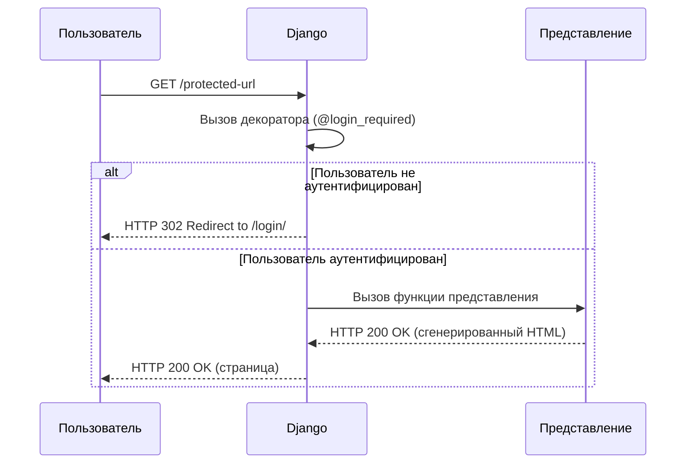
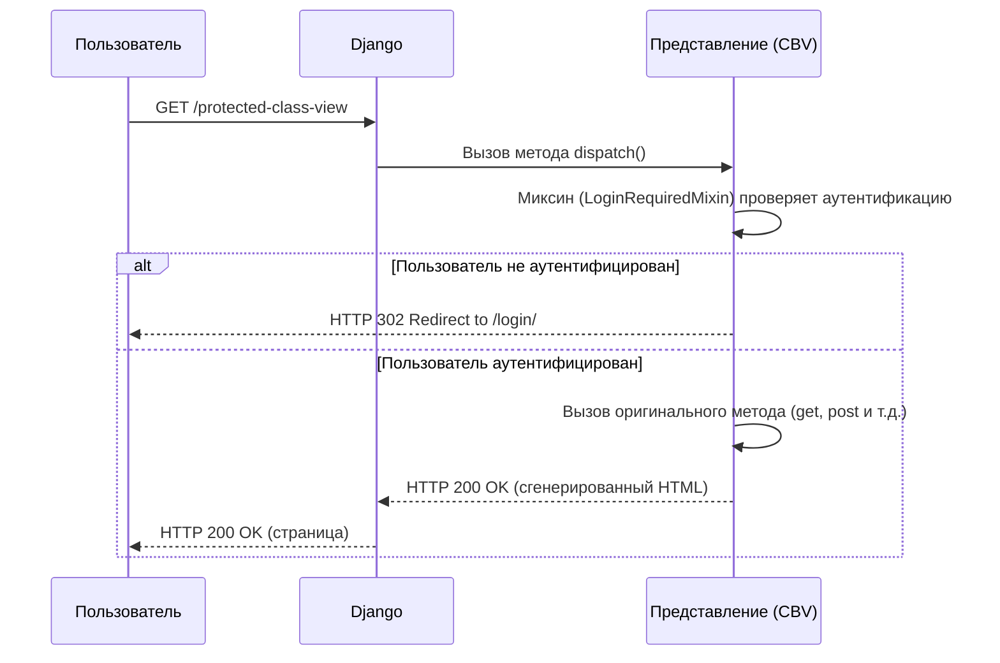

# Lesson 67 - LoginRequiredMixin и UserPassesTestMixin 🔐

В Django существуют мощные и гибкие инструменты для контроля доступа к вашим представлениям (views). Это критически важный аспект веб-разработки, позволяющий разграничивать права пользователей и обеспечивать безопасность приложения. В этой лекции мы подробно разберем, как защищать функциональные (FBV) и классовые (CBV) представления, а также как управлять отображением контента на уровне шаблонов.

## На функциональных вью есть `login_required` и `user_passes_test` и `permission_required` 🛡️

Для функциональных представлений в Django принято использовать декораторы. Декоратор — это, по сути, функция, которая "оборачивает" другую функцию, добавляя ей новую функциональность до или после ее выполнения. В нашем случае декораторы будут проверять права пользователя перед тем, как выполнить основной код представления.

### ### Проверка авторизации с `login_required`

Самая базовая и частая проверка — это убедиться, что пользователь вообще вошел в систему. Для этого используется декоратор `@login_required`.

Если неавторизованный пользователь попытается получить доступ к представлению, защищенному этим декоратором, Django автоматически перенаправит его на страницу входа.
Этот механизм обеспечивает базовый уровень защиты для страниц, которые не должны быть общедоступными, например, личные кабинеты, страницы профиля или внутренние дашборды.

```python
from django.contrib.auth.decorators import login_required
from django.shortcuts import render

@login_required
def profile_view(request):
    # Логика этого представления будет доступна только
    # для аутентифицированных пользователей.
    return render(request, 'users/profile.html')
```

>[!info]
>
>#### Куда происходит перенаправление?
>
>По умолчанию, `login_required` перенаправляет на URL, указанный в `settings.LOGIN_URL`. Если этот параметр не задан, будет использовано значение `/accounts/login/`. Вы также можете указать URL для перенаправления прямо в декораторе: `@login_required(login_url='/users/login/')`.

### ### Гибкая проверка условий с `user_passes_test`

Когда простой проверки аутентификации недостаточно, на помощь приходит `@user_passes_test`. Он позволяет вам определить собственную функцию для проверки, которая должна принимать объект `user` и возвращать `True`, если доступ разрешен, и `False` в противном случае.

Это идеально подходит для проверки специфичных атрибутов пользователя, например, флага `is_staff`.

```python
from django.contrib.auth.decorators import user_passes_test

def is_staff_check(user):
    """Проверяет, является ли пользователь персоналом."""
    return user.is_staff

@user_passes_test(is_staff_check)
def staff_dashboard_view(request):
    # Этот раздел сайта доступен только для персонала.
    return render(request, 'core/staff_dashboard.html')
```

Как и `login_required`, этот декоратор по умолчанию перенаправит пользователя на страницу входа, если проверка не пройдена. Вы можете изменить это поведение, указав `login_url`.

### Диаграмма последовательности для декораторов

Визуализация процесса помогает лучше понять, как работают эти проверки.



Эта диаграмма наглядно показывает, что декоратор выступает в роли "стража", который решает, пропустить ли запрос к представлению или отправить пользователя на страницу аутентификации.

### ### Проверка разрешений с `permission_required`

Для более гранулярного контроля доступа, основанного на системе разрешений Django, используется декоратор `@permission_required`. Он проверяет, имеет ли пользователь конкретное разрешение (permission). Django автоматически создает разрешения `add`, `change`, `delete`, `view` для каждой модели.

```python
from django.contrib.auth.decorators import permission_required

@permission_required('core.change_order')
def edit_order_view(request, order_id):
    # Только пользователи с правом 'change_order' для приложения 'core'
    # смогут редактировать заказ.
    # ... логика редактирования ...
```

Этот подход позволяет создавать сложные и безопасные системы, где разные группы пользователей имеют разные возможности.

>[!warning]
>
>#### Что если права нет?
>
>По умолчанию, если у пользователя нет нужного разрешения, он будет перенаправлен на страницу входа. Чтобы вместо этого показать страницу с ошибкой "403 Forbidden" (Доступ запрещен), передайте параметр `raise_exception=True`: `@permission_required('core.change_order', raise_exception=True)`.

## На классовых вью есть `LoginRequiredMixin` и `UserPassesTestMixin` и `PermissionRequiredMixin` 🧩

Для классовых представлений (CBV) используется аналог декораторов — миксины (mixins). Миксин — это специальный класс, который "подмешивается" к основному классу представления, добавляя ему свою логику. Миксины для проверки прав являются отличным примером принципа DRY (Don't Repeat Yourself), позволяя переиспользовать логику проверки в разных частях проекта.
>[!highlight]
>
>#### Порядок наследования важен
>
>Миксины для проверки прав должны всегда идти **перед** базовым классом представления в списке наследования. Например: `class MyView(LoginRequiredMixin, ListView):`. Это гарантирует, что проверка прав произойдет до того, как `dispatch` начнет обрабатывать запрос и выполнять основную логику вью.

### ### Проверка авторизации с `LoginRequiredMixin`

Этот миксин является прямым аналогом декоратора `@login_required`. Если пользователь не аутентифицирован, он будет перенаправлен на страницу входа.

В нашем проекте `ServicesListView` доступен только авторизованным пользователям, что реализовано с помощью этого миксина. Это гарантирует, что список услуг увидят только зарегистрированные клиенты.

```python
# core/views.py

from django.contrib.auth.mixins import LoginRequiredMixin
from django.views.generic import ListView
from .models import Service

class ServicesListView(LoginRequiredMixin, ListView):
    model = Service
    template_name = "services_list.html"
    # login_url = '/custom-login-url/' # Можно переопределить URL
    # redirect_field_name = 'next' # Имя GET-параметра для возврата
```

### Гибкая проверка условий с `UserPassesTestMixin`

Аналогично декоратору `@user_passes_test`, этот миксин позволяет определить сложную логику проверки. Для этого нужно переопределить метод `test_func`.

В нашем проекте мы создали собственный миксин `UserIsStuffPassedMixin`, который проверяет, является ли пользователь персоналом (`is_staff`). Это отличный пример того, как можно инкапсулировать повторяющуюся логику проверки в одном месте.

```python
# core/views.py

from django.contrib.auth.mixins import UserPassesTestMixin

class UserIsStuffPassedMixin(UserPassesTestMixin):
    """
    Миксин для проверки, является ли пользователь персоналом сайта
    """
    def test_func(self):
        return self.request.user.is_staff

# Пример использования
class ServiceCreateView(UserIsStuffPassedMixin, CreateView):
    # ... остальной код ...
```

### Диаграмма последовательности для миксинов

Эта диаграмма иллюстрирует, как миксин встраивается в процесс обработки запроса. Метод `dispatch` классового представления перед выполнением основной логики (например, `get` или `post`) вызывает проверку, определенную в миксине. Если проверка не пройдена, жизненный цикл представления прерывается, и пользователь перенаправляется. В противном случае — обработка запроса продолжается в штатном режиме.



### Проверка разрешений с `PermissionRequiredMixin`

Этот миксин позволяет декларативно указать, какие разрешения требуются для доступа к представлению. Вы можете указать одно или несколько разрешений. Если у пользователя нет **всех** перечисленных прав, доступ будет запрещен. Это мощный инструмент для реализации ролевых моделей доступа (RBAC), где действия четко привязаны к определенным правам.
Этот миксин проверяет наличие у пользователя конкретных прав и является аналогом `@permission_required`.

В нашем проекте редактирование заказа (`OrderUpdateView`) защищено этим миксином, требующим право `core.change_order`.

```python
# core/views.py

from django.contrib.auth.mixins import PermissionRequiredMixin

class OrderUpdateView(PermissionRequiredMixin, UpdateView):
    permission_required = "core.change_order"
    # permission_required = ("core.change_order", "core.view_order") # Можно несколько
    model = Order
    # ... остальной код ...
```

Как и декоратор, миксин по умолчанию вернет ошибку 403, если у пользователя нет прав.

## Проверка прав на уровне шаблонов 🖼️

Контроль доступа в представлениях — это основа безопасности, но часто нам нужно просто скрыть или показать определенные элементы интерфейса в зависимости от прав пользователя. Например, кнопку "Редактировать" должен видеть только тот, кто может редактировать. Для этого в Django есть удобные инструменты прямо на уровне шаблонов. Это не только улучшает пользовательский опыт, но и помогает избежать путаницы, показывая пользователям только те действия, которые им доступны.

### `if user.is_authenticated` - проверка авторизации

Это самая простая и распространенная проверка. Она позволяет отображать разный контент для гостей и для зарегистрированных пользователей. Например, вместо формы входа показывать приветствие и ссылку на профиль.
Самая базовая проверка — это наличие аутентификации. В контекст каждого шаблона по умолчанию передается объект `user`, у которого есть удобный флаг `is_authenticated`.

```html

    <p>Добро пожаловать, {{ user.username }}!</p>
    <a href="">Выйти</a>

    <a href="">Войти</a>

```

### Любые поля модели User - `is_staff`, `is_superuser`, `is_active` - проверка прав

Вы можете использовать любые булевы поля стандартной модели `User` для проверки. Чаще всего используются `is_staff` и `is_superuser` для отображения ссылок, ведущих в административную часть сайта.
Это особенно полезно для разграничения контента для обычных пользователей и для административного персонала. Например, ссылка на админ-панель или на страницу с отчетами должна быть видна только сотрудникам.

```html

    <a href="/admin/">Панель администратора</a>

```

### Проверка конкретных разрешений через `perms`

Для более тонкой настройки в контекст шаблона передается объект `perms`. Он позволяет проверить наличие у пользователя конкретного права в формате `app_label.codename`. Это очень удобно для гранулярного контроля над интерфейсом.

>[!info]
>
>#### Суперпользователь и права
>
>Важно помнить, что суперпользователь (`is_superuser=True`) в Django по умолчанию обладает **всеми** возможными правами в системе, даже если они ему явно не назначены. Поэтому любые проверки через `perms` для суперпользователя всегда будут возвращать `True`.
Такая проверка позволяет, например, показывать кнопку "Редактировать заказ" только тем пользователям, у которых есть на это право, делая интерфейс чище и понятнее.

```html

    <a href="">Редактировать заказ</a>



    <a href="">Добавить новую услугу</a>

```

### Написание собственного фильтра шаблона

В Django нельзя вызывать методы с аргументами в шаблонах (например, `user.has_perm('core.add_order')` не сработает). Также нет встроенного способа проверить принадлежность к группе.

>[!warning]
>
>#### Суперпользователь и группы
>
>Принадлежность к группам для суперпользователя (`is_superuser`) не проверяется автоматически. Если логика вашего приложения завязана на группах, суперпользователя нужно будет **явно добавить** в соответствующую группу, чтобы проверки `user|has_group:"GroupName"` для него работали корректно.

Решение — создать собственный шаблонный фильтр. Это просто и очень эффективно.

**1. Создаем файл для тегов:**
В приложении (например, `core`) создаем директорию `templatetags` и в ней файл `__init__.py` (чтобы Python считал директорию пакетом) и файл для наших тегов, например, `user_tags.py`.

**2. Пишем код фильтра:**

Этот код определяет простой фильтр, который принимает объект пользователя и имя группы, а затем проверяет, состоит ли пользователь в этой группе. Использование `try-except` блока делает фильтр более надежным: если группы с таким именем не существует, он не вызовет ошибку, а просто вернет `False`.

```python
# core/templatetags/user_tags.py
from django import template
from django.contrib.auth.models import Group

register = template.Library()

@register.filter(name='has_group')
def has_group(user, group_name):
    try:
        group = Group.objects.get(name=group_name)
    except Group.DoesNotExist:
        return False
    return group in user.groups.all()
```

**3. Используем в шаблоне:**

Сначала загружаем наши теги в начале шаблона, а затем используем фильтр через пайп `|`.
Сначала загружаем наши теги в начале шаблона с помощью ``, а затем используем фильтр через пайп `|`, передавая имя группы в кавычках. Это позволяет создавать очень читаемые и декларативные проверки прямо в HTML-коде.

```html



    <a href="">Панель Менеджера</a>

```

>[!highlight]
>
>#### Важное замечание
>
>Проверки в шаблонах — это лишь способ улучшить пользовательский опыт, скрывая ненужные элементы. Они **не заменяют** полноценную проверку прав на стороне сервера в представлениях! Злоумышленник все еще может попытаться получить доступ к URL напрямую.
